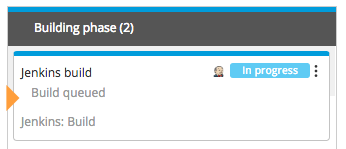
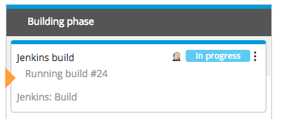

When creating [custom task types](/xl-release/how-to/create-custom-task-types.html) in XL Release 6.1.0 and later, you can provide a script that checks for the availability of a resource and another script that does something when the conditions are satisfied.

XL Release will schedule the execution of the scripts and poll for the availability of the resource according to a configurable interval. If the server is stopped while the polling script is running, XL Release will restart the script when the server is started again.

Before XL Release 6.1.0, it was not possible to execute multiple Python scripts in a single task. This meant that, if you wanted to fetch a resource by executing an `HttpRequest` and the resource was not yet available, your script would need to loop until the resource became available. This looping could cause performance issues on the XL Release server.

Also, as of XL Release 6.1.0, you can show custom text under the custom task name in the [release flow editor](/xl-release/how-to/using-the-release-flow-editor.html).

## Python script example

This example shows how the [Jenkins Build](/xl-release/how-to/create-a-jenkins-task.html) task is implemented using different scripts for different stages of the Jenkins build lifecycle.

### Definition in `synthetic.xml`

This is the definition of the Jenkins Build task in the `synthetic.xml` file:


...
<type type="jenkins.Build" extends="xlrelease.PythonScript">
       <property name="scriptLocation" default="jenkins/Build.py" hidden="true" />
       <property name="iconLocation" default="jenkins/jenkins.png" hidden="true" />

       <property category="input" name="jenkinsServer" label="Server" kind="ci" referenced-type="jenkins.Server" description="Jenkins server to connect to"/>
       <property category="input" name="username" required="false" description="Overrides the password used to connect to the server"/>
       <property category="input" name="password" password="true" required="false" description="Overrides the password used to connect to the server"/>
       <property category="input" name="jobName" description="Name of the job to trigger."/>
       <property category="input" name="jobParameters" size="large" required="false" description="Jenkins job parameters, one parameter per line."/>

       <property category="output" name="buildNumber" required="false" description="Build number of the triggered job"/>
       <property category="output" name="buildStatus" required="false" description="Build status of the triggered job"/>

       <property category="script" name="location" required="false" description="Location header returned by jenkins"/>
</type>
...


The `location` property is of category `script` and is similar to an `output` property, the only difference is that it is not shown in the UI. The `output` and `script` properties can be used to send information between Python scripts in the same task.

### Python scripts

The Python script that is configured on the Jenkins Build task is `jenkins/Build.py` and this is the first script that will be run.


...
buildResponse = request.post(buildContext, '', contentType = 'application/json')

if buildResponse.isSuccessful():
    # Query the location header which gives a queue item position

    location = None
    if 'Location' in buildResponse.getHeaders() and '/queue/item/' in buildResponse.getHeaders()['Location']:
        location = '/queue/item/' + filter(None, buildResponse.getHeaders()['Location'].split('/'))[-1] + '/'

    task.setStatusLine("Build queued")
    task.schedule("jenkins/Build.wait-for-queue.py")

else:
    print "Failed to connect at %s." % buildUrl
    buildResponse.errorDump()
    sys.exit(1)


The status line provided in `task.setStatusLine("Build queued")` will appear in the UI:

The `task.schedule(pollingScriptPath)` call lets XL Release know that after the current script is finished the task does not finish yet. Instead another script should be executed after a delay. You must pass the path to the script in the method argument. You can also specify a wait interval in seconds as a second parameter: `task.schedule(pollingScriptPath, 2)`. If not specified, the server will wait 5 seconds before invoking the script. (This value can be configured -see below).

To fail the script, use `sys.exit(1)`.

If the response was successful, the next script that is executed will be `Build.wait-for-queue.py`:

We have set the `location` variable in the `Build.py` script. Since we have defined in the `synthetic.xml` as a variable of category `script`, it will also be available in the `Build.wait-for-queue.py` script.


...
if location:
    # Check the response to make sure we have an item
    response = request.get(location + 'api/json', contentType='application/json')
    if response.isSuccessful():
        buildNumber = JsonPathResult(response.response, 'executable.number').get()
        if not buildNumber:
            # if there is no build number yet then we continue waiting in the queue
            task.schedule("jenkins/Build.wait-for-queue.py")
        else:
            # if we have been given a build number this item is no longer in the queue but is being built
            task.setStatusLine("Running build #%s" % jobBuildNumber)
            task.schedule("jenkins/Build.wait-for-build.py")
    else:
        print "Could not determine build number for queued build at %s." % (jenkinsURL + location + 'api/json')
        sys.exit(1)
else:
    ...


If there is no build number yet, we need to keep waiting. We do this by scheduling the same script again. This is how you implement a polling loop using the `task.schedule()` function.

When the build is running, the request to the Jenkins server will return a build number and we can wait for the build to complete. The script changes the status line to tell that Jenkins is now running the build and script that will wait for build completion is now scheduled: `task.schedule("jenkins/Build.wait-for-build.py")`


...
response = request.get(jobContext + str(buildNumber) + '/api/json', contentType='application/json')
if response.isSuccessful():
    buildStatus = JsonPathResult(response.response, 'result').get()
    duration = JsonPathResult(response.response, 'duration').get()

    if buildStatus and duration != 0:
        print "\nFinished: %s" % buildStatus
        if buildStatus != 'SUCCESS':
            sys.exit(1)

    else:
        # Continue waiting for the build to be finished
        task.schedule("jenkins/Build.wait-for-build.py")

else:
    ...


When this script finishes without error and no other script is scheduled, the task completes and XL Release moves on to the next task in the release flow.

## Script execution and task completion

This is a summary of what can happen during the execution of the script of a custom task and how it influences the state of the running task.

* `sys.exit()` is called: the script stops executing and the task fails.
* An exception is raised: the script stops executing and the task fails.
* `task.schedule()` is called: the script continues to execute, but when the script finishes, the task remains in progress and the next script is scheduled for execution.
* The script finishes without errors: unless `task.schedule()` was called, the custom task completes and XL Release moves on to the next task in the release flow.

## Configuration options

By default, the wait interval between scripts is 5 seconds, if not specified on the `task.schedule()` call. You can configure this interval in the `XL_RELEASE_SERVER_HOME/conf/xl-release.conf` file:

    xl.durations.customScriptTaskScheduleInterval = 10 seconds

The interval may not be less than 1 second.
