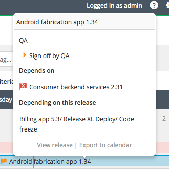

To see an overview of all releases in XL Release on a month-by-month basis, select **Releases** > **Calendar** from the top bar (in XL Release 5.0.x and earlier, click **Calendar** in the top bar).

On the calendar, releases appear as light blue bars.

To see more information about a release, click it.

**Tip:** Hover over a dependent release to see it highlighted in the calendar.

## Filtering the calendar

To filter the calendar, click **Filter options** and select:

* **All active releases** to show releases that are currently in progress
* **All planned releases** to show planned releases that have not started yet
* **All completed and aborted releases** to show releases that are completed or aborted
* **Only my releases** to show releases that you own
* **Only flagged releases** to show releases that are flagged with a status message to indicate that they need attention or are at risk

To filter on the release title or tag, use the **By title or tag** box.

## Marking special days

You can mark special days such as holidays by clicking  in the day on the calendar and selecting **Set label**. You can give special days a custom label and background color.

## Setting blackout period

You can set a blackout period to ensure that specific tasks cannot be performed during that time. For more information about blackout period, refer to [Set blackout period](/xl-release/how-to/set-blackout-period.html).
