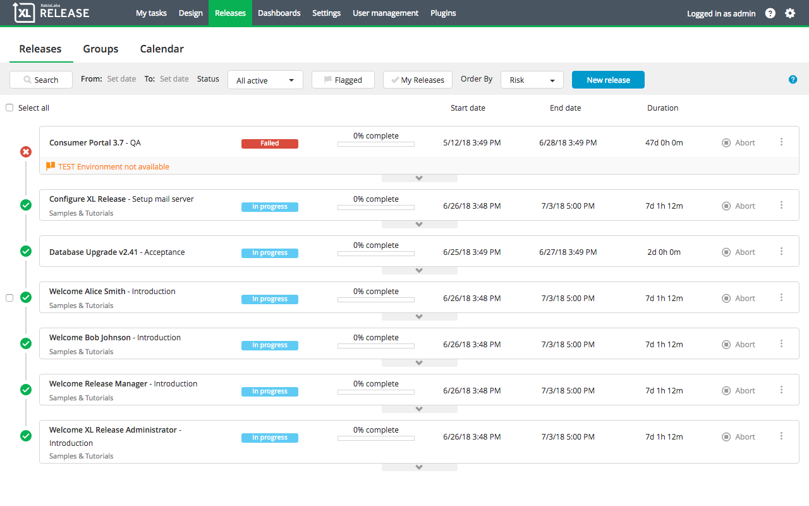

To see the list of releases that you have permission to view and that are planned, active (including releases that are in progress, paused, failing, or failed), or completed (including aborted), select **Releases** > **Overview** from the top bar. The release overview shows the [status](/xl-release/concept/release-life-cycle.html) of each release, as well as any status flags that have been set.

## Release overview actions

* Click in any place on a release to open the release in the [release flow editor](/xl-release/how-to/using-the-release-flow-editor.html)
* Click the arrow button under a release to expand the phase pipeline view of that release. This shows how much of each release has been completed and any flags that have been set on the release or tasks within it. Click the arrow again to collapse the phase pipeline view.

Next to each release, click:

* **View** to open the release in the [release flow editor](/xl-release/how-to/using-the-release-flow-editor.html) (XL Release 6.1.0 and earlier)
* **Start** to start a release that is in the *planned* state
* **Abort** to abort the release

**Note:** You can start or abort multiple releases at the same time. Click the checkbox next to each release to select the release.

**Note:** When any action is performed on multiple releases at the same time, only one notification email is sent to each recipient containing the action performed and the list of releases.

## Filter releases

You can filter the releases using different criteria.

Click **Search** to expand the search options and then type a part of a release title or release tags in the **Title** and **Tag(s)** boxes. When you start typing the release tag name, the tag autocompletes from a database of a maximum of 500 tags. Click **Search** again to collapse the search options.

You can also filter the releases by clicking **My Releases** to see only your releases and/or **Flagged** to see the flagged releases.

To filter the release overview by the status of the release, click **Status** and select:

* **Planned** to show releases that have been created but that have not started yet (in the *planned* state)
* **All active** to show releases that are busy:

   * **In progress** releases that are in the *in progress* state
   * **Paused** releases that are in the *paused* state
   * **Failing** releases that are in the *failing* state
   * **Failed** releases that are in the *failed* state

* **All completed** to show releases that are completed and aborted (in the *completed* or *aborted* state)

  * **Aborted** only releases in *aborted* state
  * **Completed** only releases in *completed* state

## Dates in the release overview

The **Start date** column shows:

* The planned start date if the release is scheduled in the future
* The actual start date if the release has already started

The **End date** column shows:

* The planned end date if the release is not complete
* The actual end date otherwise

Overdue dates appear in red.

The **Duration** column shows the duration of the release.

**Note** The release overview shows a percentage complete status based on the number of tasks completed in each release.

## Sorting releases in release overview

To order the release overview, click **Order by** and select:

* **Risk** to show the releases with the highest risk level at the top
**Note:** The sorting is done based on risk calculation, displaying the release with the maximum risk score at the top. If multiple releases have the same maximum risk score, a second sorting rule is applied calculating the total risk sum for each release.
* **Start date** to show the releases with earliest start date on top
* **End date** to show the release with latest end date on top

For more information about release risk awareness, refer to [Using risk awareness in XL Release ](/xl-release/how-to/using-the-risk-aware-view.html).

## Filtering the release overview (XL Release 6.1.0 and earlier)

To filter the release overview, click **Filter options** and select:

* **All active releases** to show releases that are busy (in the *in progress*, *failing*, or *failed* state)
* **All planned releases** to show releases that have been created but that have not started yet (in the *planned* state)
* **All completed and aborted releases** to show releases that are completed or aborted (in the *completed* or *aborted* state)
* **Only my releases** to show releases for which you are the release owner
* **Only flagged releases** to show releases that are flagged with a warning message; use this option to see releases that are currently at risk

To filter on the release title, use the **Filter by title or tag** box.

To filter on dates, use the **From** and **To** options.
