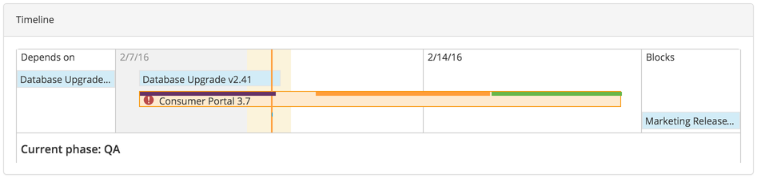
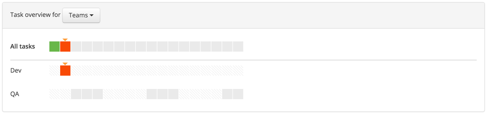

In a release, select **Release summary** from the **Show** menu to go to the release summary page, where you can see an overview of the current release.

**Note:** In XL Release 5.0.0, the release summary is replaced by the [release dashboard](/xl-release/how-to/using-the-release-dashboard.html).

## Timeline

The **Timeline** section shows a timeline of the release. The complete timeline appears in orange, with lines indicating the phases within it. The current phase and currently active tasks appear below the timeline.

The timeline start and end dates appear as follows:

* If an item has not started, its *scheduled start date* and *due date* appear.
* If an item is complete, the *actual start and end dates* appear.
* If an item is in progress, the start date that appears is the *actual start date*. If the item is on schedule and the scheduled start date is after the current date, then the end date is the *scheduled start date*. Otherwise, the end date is the *current date*.

## Release dependencies

If the release depends on other releases (as specified on a [gate task](/xl-release/how-to/create-a-gate-task.html)), then they appear above the release in the timeline, under **Depends On**.

If other releases depend on this release, then they appear below the release in the timeline, under **Blocks**.

## Task overview

The **Task overview** section shows upcoming tasks, tasks that are currently active, and tasks that need to be done. You can view the task overview for teams or for users.

## Alerts

The **Alerts** section shows release warnings.

There are several types of warnings:

* **Status flags** shows flags that have been manually set on the release or on a task to indicate that the release needs attention or is at risk
* **Dependencies** shows alerts for dependent releases that are not finished
* **Delays** shows all active and planned tasks that have a due date in the past
