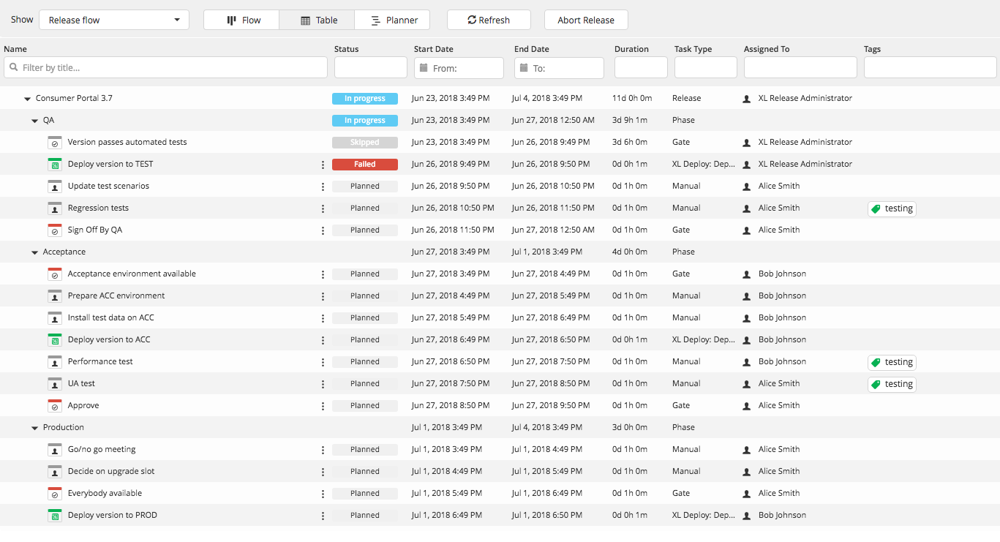

The XL Release table view provides an alternative view of a template or release that is optimized for working with tasks. In table view, you can:

* Filter phases and tasks based on name, start date, end date, duration, type, and/or assignee
* Directly open a task by clicking its name
* Use the task action menu () to quickly assign a task to yourself, change its type, duplicate it, or delete it
* Perform actions on multiple tasks

You can select multiple tasks from the list and perform various actions:
* Assign to Assign the selected tasks to a user or team
* Add comment Add a comment on all the selected tasks
* Complete Complete the selected tasks

Click the **More actions** button and select an option from the list:
* Fail Fail the selected tasks
* Retry Retry the selected tasks
* Abort Abort the selected tasks
* Skip Skip the selected tasks
* Reopen Reopen the selected tasks
* Delete Delete the selected tasks
* lock Lock the selected task (XL Release 8.0 and later)   
 **Note:** A locked task appears with the following icon . When a task is locked, only users with lock permissions are able to edit or unlock it. For more information, see [Configuring lock tasks](http://docs.xebialabs.com/xl-release/how-to/configure-lock-tasks.markdown).
* Unlock Unlock the selected task (XL Release 8.0 and later)

To access the table view, click **Table** at the top of the release flow page.

