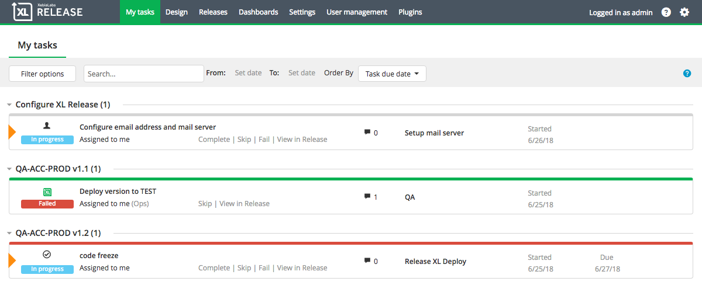
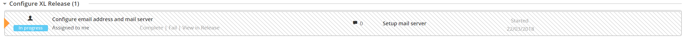

To see the list of active tasks that are assigned to you or to a team that you are in, click **My tasks** in the top bar to go to the task overview (in XL Release 5.0.x and earlier, this is called **Tasks**). The task overview shows the [status](/xl-release/concept/task-life-cycle.html) of each task, as well as any flags that have been set.

An orange triangle indicates an active task, and a clock icon indicates a pending task.

To see more information about a task, click it.

As of XL Release 8.0, is it possible to lock tasks. When a task is locked only users with lock permissions are able to edit or unlock it. A locked task appears striped to indicate that it is locked.  For more information, see [Configuring lock tasks](http://docs.xebialabs.com/xl-release/how-to/configure-lock-tasks.markdown).

## Task overview actions

Next to each task, click:

* **Complete** to complete the task, optionally add a comment, and advance to the next task in the release.
* **Skip** to skip the task, add a comment explaining why the task why skipped, and advance to the next task in the release.
* **Fail** to put a manual task in a *failed* state, add a comment explaining the problem, and notify the release owner
* **Abort** to stop an automated task and put it in a *failed* state, add a comment explaining the problem, and notify the release owner
* **Assign to me** to assign the task to yourself
* **View in Release** to open the task in the release flow editor

**Note:** Failing or aborting a task halts the release.

## Dates in the task overview

If a task has already started, its start date appears.

If the task is scheduled to start at a specific future date, that date appears. *Planned* indicates that the task is waiting for a preceding task to complete, while *Scheduled* indicates that the task is waiting for its scheduled start date.

If the task has a due date set, that date appears.

## Filtering the task overview

To filter the task overview, click **Filter options** and select:

* **Active tasks** to show tasks that are currently active (clear this option to also see tasks that are in the *planned* state)
* **Assigned to me** to show tasks that are assigned to you
* **Assigned to my teams** to show tasks that are assigned to the teams that you are in
* **Assigned to others** (version 7.2 and earlier) to show tasks that are assigned to others and to teams that you are not in
* **Assigned to anybody** (version 7.5 and later) to show tasks that are assigned to anyone
* **Not assigned** to show tasks that are not assigned to a user or a team

**Tip:** Select *Not assigned* and *Active tasks* to see the tasks that are active but not being handled by anyone.

To filter on the task title, use the **Search** box.

To filter on dates, use the **From** and **To** options.

## Ordering tasks

To order tasks within releases, click on the order options at the right of the filter options.

* **None** Order tasks by their ID (default behavior)
* **Task start date** Order tasks by their task start date
* **Task due date** Order tasks by their due date

Using task ordering you can bring up the tasks that need your attention right away.
