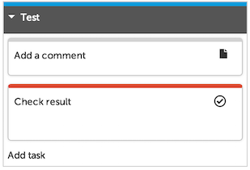
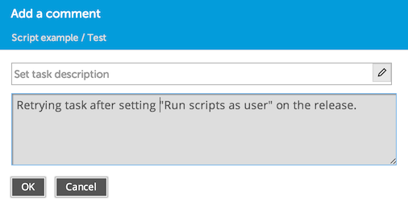

XL Release has an [API](/xl-release/latest/jython-api/index.html) that you can use to manipulate releases and tasks. You can access the API from [Jython Script tasks](/xl-release/how-to/create-a-jython-script-task.html) and from XL Release plugin scripts. This is an example of a simple Jython script in a Script task. It uses a script to add a comment to the task.

1. Go to the [release overview](/xl-release/how-to/using-the-release-overview.html) and click **New release** (because this is a simple example, you can create an empty release that is not based on a template).
1. In the release properties, set the **Release Name** to _Script example_.
1. Click **Create** to create the release.
1. In the [release flow editor](/xl-release/how-to/using-the-release-flow-editor.html), click the name of the first phase and change it to _Test_.
1. In the _Test_ phase, add two tasks:
    * A Jython Script task called _Add a comment_
    * A Gate task called _Check result_

    

1. Click the _Add a comment_ task and add the following **Script**:

        task = getCurrentTask()
        comment = Comment()
        comment.setComment("Hello World!")
        taskApi.commentTask(task.id, comment)
1. Close the task and click **Start Release**.

    The _Add a comment_ task fails. Click the task to see the reason for failure in the **Comments** section:

    

    This message indicates that you must specify the user name under which to run the script. This is because the API gives you access to releases and tasks, so XL Release needs to check the user's credentials to verify whether certain operations are allowed.
1. Close the task and select **Properties** from the **Show** menu.
1. Enter your user name and password in the **Run automated tasks as user** and **Password** boxes.

    **Tip:** For a production configuration, it is recommended that you create a global "script runner" user that can be used for this purpose, rather that using your own credentials.

1. Click **Save** to save the release properties.
1. Select **Release flow** from the **Show** list.
1. Open the _Add a comment_ task and click **Retry**.

    

    The task succeeds and the release waits at the Gate task, giving you time to inspect the script result.

    

1. Open the _Add a comment_ task and check the **Comments** section for the "Hello World!" comment:

    

### Looking at the script

The first line of the sample script uses the `getCurrentTask()` method to get a reference to the task that is currently executing (that is, the _Add a comment_ Jython Script task) and store it in a variable called `task`.

    task = getCurrentTask()

To set a comment on the task, the script uses the [`taskApi.commentTask`](/jython-docs/#!/xl-release/5.0.x//service/com.xebialabs.xlrelease.api.v1.TaskApi) endpoint. The `commentTask` method takes the task ID and a [`Comment`](/jython-docs/#!/xl-release/5.0.x//service/com.xebialabs.xlrelease.api.v1.forms.Comment) object as parameters. The `Comment` object is a simple wrapper around a string.

    comment = Comment()
    comment.setComment("Hello World!")

Then, the script calls the `commentTask()` method to add the comment to the task:

    taskApi.commentTask(task.id, comment)

**Note:** For any call to an API endpoint, such as `taskApi` or `releaseApi`, you must set the **Run automated tasks as user** property on the release. The scripts will be executed with the permissions that that user has on that particular release.
