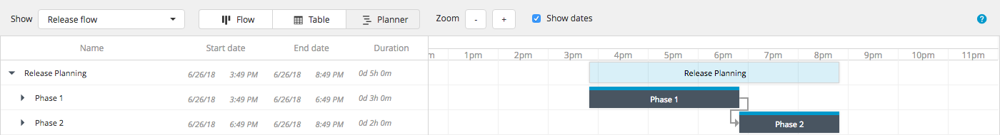
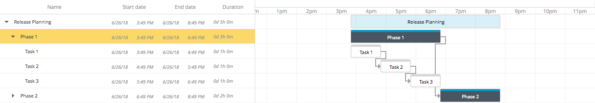
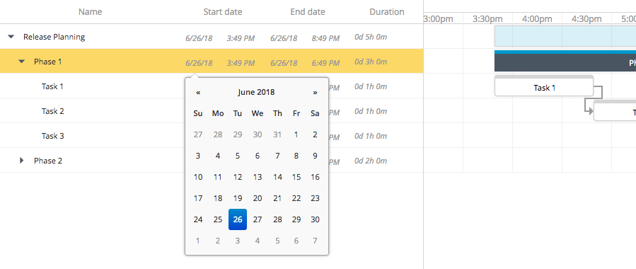

The XL Release planner allows you to use an interactive Gantt chart to view and edit the timing of the phases and tasks in a release or template. The Gantt chart is a combined timeline of the template or release, its phases, and the tasks within.

To access in the planner in XL Release 5.0.0 or later, click **Planner** at the top of the release flow page. In earlier versions of XL Release, select **Planner** from the **Show** menu.

Tasks are executed in sequential order within a phase. Therefore, in the example below, Task 2 will not start until Task 1 is complete, as indicated by the line that connects them.

## Editing tasks and phases in the planner

When editing a task or a phase in the planner, you can:

* Move it by dragging it to a new position
* Set its duration by dragging its right edge
* Set its scheduled start date by dragging its left edge
* Alternatively, set the dates and duration by clicking **Show dates** and then setting them explicitly

When you set the scheduled start date or duration of a task, the planner will automatically adjust subsequent tasks in the same phase. For more information about dates and durations, refer to [Scheduling releases](/xl-release/how-to/scheduling-releases.html)

**Tip:** Double-click a task in the planner to open its detail view.
