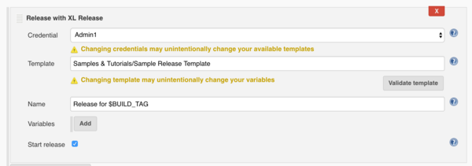

## Plugin configuration in Jenkins

There are two places to configure the XL Release plugin for Jenkins.

In the global Jenkins configuration at **Manage Jenkins** > **Configure System**, you can specify the XL Release server URL and one or more sets of credentials. Different credentials can be used for different jobs.

In the job configuration page, select **Post-build Actions** > **Add post-build action** > **Release with XL Release**. Enter the template name in the box and select a value from the drop-down list.

**Tip:** In XL Release 6.0.0 and later, type `/` in front of a folder name to see the subfolders and template names in the specified folder.

After you select the template, click **Validate template** to validate it.

To get information about each setting, click **?** located next to the setting.

## Using the Jenkinsfile

In version 6.1.0 and later, you can use the [Jenkins Pipeline](https://jenkins.io/solutions/pipeline/) feature with the XL Release plugin for Jenkins. This feature allows you to create a "pipeline as code" in a Jenkinsfile, using the Pipeline DSL. You can then store the Jenkinsfile in a source control repository.

For more information about the Jenkins task in XL Release, see [Create a Jenkins task](/xl-release/how-to/create-a-jenkins-task.html).

### Create a Jenkinsfile

To start using Jenkinsfile, create a pipeline job and add the Jenkinsfile content to the **Pipeline** section of the job configuration.

For a detailed procedure on how to use the Jenkins Pipeline feature with the Xl Release plugin for Jenkins, see the [XebiaLabs XL Release Plugin](https://jenkins.io/doc/pipeline/steps/xlrelease-plugin/).

For information about the Jenkinsfile syntax, see the [Jenkins Pipeline documentation](https://jenkins.io/doc/book/pipeline/jenkinsfile/#creating-a-jenkinsfile). For information about the items you can use in the Jenkinsfile, click **Check Pipeline Syntax** on the job.

For information about how to add steps to Jenkinsfile, see the [Jenkins Plugin Steps documentation](https://jenkins.io/doc/pipeline/steps/xlrelease-plugin/).

### Jenkinsfile example

The following Jenkinsfile can be used to build a pipeline and deploy a simple web application to a Tomcat environment configured in XL Release.

      node {
      stage('Package') {
        xldCreatePackage artifactsPath: 'build/libs', manifestPath: 'deployit-manifest.xml', darPath: '$JOB_NAME-$BUILD_NUMBER.0.dar'
      }
      stage('Publish') {
        xldPublishPackage serverCredentials: '<user_name>', darPath: '$JOB_NAME-$BUILD_NUMBER.0.dar'
      }
      stage('Deploy') {
        xldDeploy serverCredentials: '<user_name>', environmentId: 'Environments/Dev', packageId: 'Applications/<app_name>/$BUILD_NUMBER.0'
      }
      stage('Start XLR Release') {
           xlrCreateRelease serverCredentials: '<user_name>', template: 'Release <app_name>', releaseTitle: 'Release for $BUILD_TAG', variables: [[propertyName: 'version', propertyValue: '$BUILD_NUMBER.0']], startRelease: true
      }
    }

## Release notes

### Version 7.5.1

### Improvements

* REL-6099 Adding override credentials functionality in Jenkinsfile.

### Version 7.5.0

### Improvements

* REL-5850 Allow user to override credentials in plugin.

### Version 6.1.2

### Improvements

* REL-4251 Show deprecation warning in Jenkins XL Release plugin when the version parameter is used

### Bug fixes

* REL-4280 Variable names set in Jenkins post-build action are overwritten by first variable in list
* REL-4282 Jenkins XL Release plugin 6.1.1 does not support Java 7

### Version 6.1.1

#### Improvements

* REL-4105 Rename the `version` parameter on the `xldCreateRelease` step to `releaseTitle`

**Note:**

* Version 6.1.1 of the plugin is not compatible with Java 7. To use version 6.1.1, you must use Java 8. To use the plugin with Java 7, upgrade the plugin to version 6.1.2.
* The `version` parameter is now deprecated.

### Version 6.1.0

#### Improvements

* Support Jenkins Pipeline, which allows you to create a "pipeline as code" in a Jenkinsfile that can be checked into source control

### Version 6.0.0

#### Improvements

* Support for XL Release 6.0.0 with folders
* Variable names shown without `${ }`

### Version 5.0.0

#### Improvements

* REL-3468 Support Jenkins credentials in XL Release plugin for Jenkins

**Note:** The Jenkins Credentials Plugin must be installed and enabled in Jenkins.
