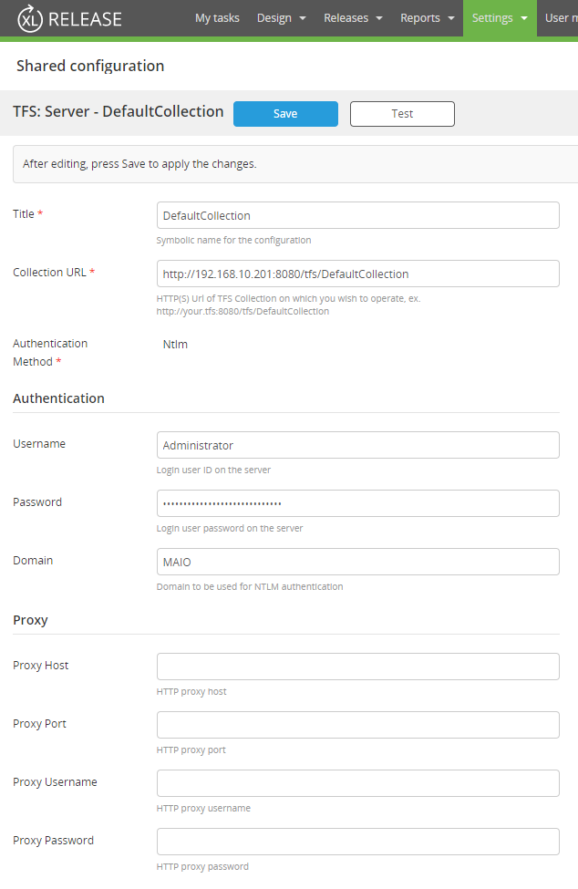
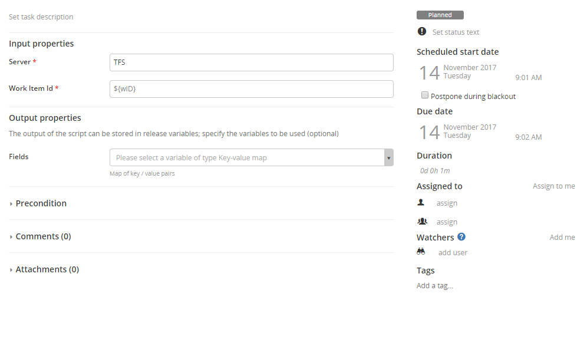
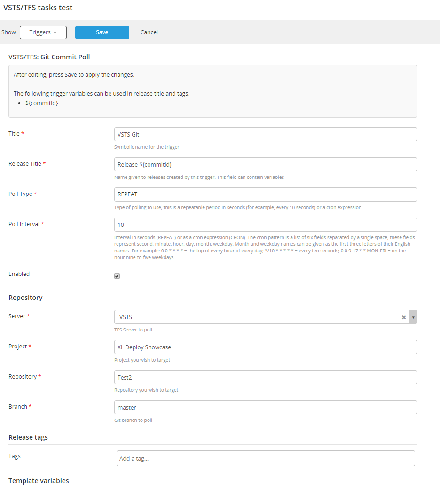
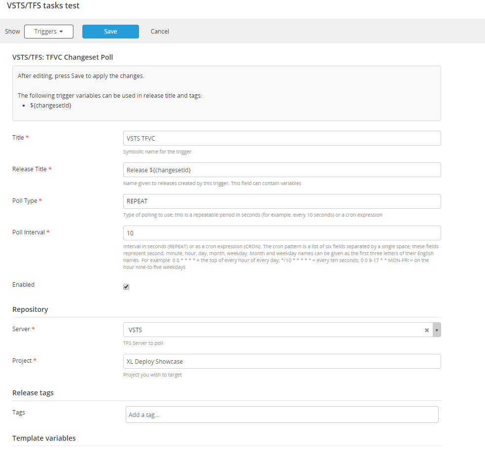

## Requirements

* [XL Release 6.1.0](/xl-release/concept/requirements-for-installing-xl-release.html) or later
**Note:** If you are using XL Release version 7.5.0 or later, you must use the XL Release VSTS/TFS plugin version 7.5.1. The XL Release VSTS/TFS plugin version 7.5.0 is not compatible with XL Release version 7.5.0.
* Visual Studio Team Services (VSTS) or Team Foundation Server 2015

## Supported VSTS/TFS operations

Work Item operations:

* Create new Work Item
* Retrieve Work Item
* Update Work Item
* Update Work Items by Query
* Query Work Items

Build operations:

* Tag a build
* Queue new build

Triggers:

* Git commit trigger
* TFVC change-set trigger

### Supported authentication types

{:.table .table-striped}
| VSTS/TFS versions | Authentication |
| ----------------- | ------ |
| TFS 2015 | Basic and NTLM authentication types |
| TFS 2017 | Basic, NTLM, and PAT authentication types |
| VSTS | PAT authentication type |

For more information, refer to [Authenticate access with personal access tokens for VSTS and TFS](https://docs.microsoft.com/en-us/vsts/accounts/use-personal-access-tokens-to-authenticate).

## Set up a VSTS/TFS server

To set up a connection to a VSTS service or your TFS collection:

1. In XL Release, go to **Settings** > **Shared configuration** and, under the **TFS Server**, click **Add server**.
1. Specify a name for this connection.
1. Collection URL field must be set to the full URL pointing towards your TFS collection (for example: http://my.tfs.address:8080/tfs/DefaultCollection). Make sure that the collection name is included. For VSTS, insert the URL of your account (for example: https://myaccount.visualstudio.com).
1. Select the authentication type.
1. For Basic authentication, fill in the username and password fields accordingly. For NTLM, you must also specify your domain name in the Domain field. For PAT, skip the username field and, in password field, set your personal access token.
1. If your XL Release server is using a proxy, specify the necessary values accordingly.

## Using the work item management tasks

The work item management tasks allow you to perform several operations with work items on VSTS/TFS such as creating new work items, updating existing Work Items, retrieve, or query work items.

### Create a work item task

This task creates any type of VSTS/TFS work item. These input properties are available:

* Server: The VSTS/TFS instance to be used
* Team Project Name: The name of the project where the work item will be created
* Work Item Type: The type of the work item (Examples: Bug, Product Backlog Item)
* Work Item Title: The title of the work item
* Tags: Work item tags
* Fields: Additional fields that should be modified. Each Work Item in VSTS/TFS is based on multiple fields. Custom fields can be added by a custom work item process template (Standard fields examples: "System.AreaPath", "Microsoft.VSTS.Common.Priority"). Each of the available fields can be modified by specifying the field name as a key and the desired value as a value in the fields map. For more information, refer to [Work item filed index](https://docs.microsoft.com/en-us/vsts/work/work-items/guidance/work-item-field).

Output properties:

* Work Item ID: The ID of the new Work Item

### Retrieve a work item task

This task retrieves any specified Work Item and brings back all its fields. To manipulate the output property, use the Script Task or the [XL Release Variable Manipulation Community Plugin](https://github.com/xebialabs-community/xlr-variable-manipulation-plugin).

These properties are available:

* Server: The VSTS/TFS instance to be used
* Work Item ID: The ID of the work item that you want to retrieve

Output properties:

* Fields: All the retrieved fields of the work item

### Query work items

This task allows you to retrieve multiple Work Items IDs by specifying a WIQL query. For more details about the WIQL, refer to the following documentation [Syntax for the Work Item Query Language (WIQL)](https://docs.microsoft.com/en-za/vsts/collaborate/wiql-syntax).

To customize the output properties, use the Script Task or the [XL Release Variable Manipulation Community Plugin](https://github.com/xebialabs-community/xlr-variable-manipulation-plugin).

These input properties are available:

* Server: The VSTS/TFS instance to be used
* Query: Specify a query written in WIQL language

Output properties:

* Retrieved IDs: List of work item IDs that are retrieved by the query

## Build operations tasks

### Queue new build task

The Queue new build task allows you to queue a build on your VSTS/TFS server.

These input properties are available:

* Server: The VSTS/TFS instance to be used
* Team Project Name: The name of the project where the build definition is set
* Build definition name: The name of the build definition from where you want to trigger a build

Output properties:

* Build ID: Unique identifier of the build run
* Build Number: The assigned value from the build engine based on the Build number format option in your build definition
* Build Result: Build run result

**Note:** If the queued build fails, the task will also fail.

### Tag a build task

The task to tag a build allows you do add one or more tags on your build.

These input properties are available:

* Server: The VSTS/TFS instance to be used
* Team Project Name: The name of the project where the build definition is set
* Build ID: The ID of the build where to apply the tag(s)
* Tags: A list of strings that are added to the build as tags

## Using Triggers

### The git commit trigger

If you want your release to be created and started by a commit in a VSTS/TFS Git repository, you can setup this trigger.

These input properties are available:

* Server: The VSTS/TFS instance to be used
* Project: The name of the project where the Git repository is created
* Repository: The name of the Git repository
* Branch: The branch that should be monitored for the changes

### The TFVC `changeset` trigger

If you want your release to be created and started by a new `changeset` in a TFVC repository, you must setup this trigger.

These input properties are available:

* Server: The VSTS/TFS instance to be used
* Project: The name of the project where the associated TFVC repository should be monitored

