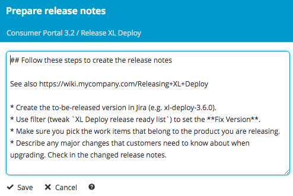

To edit a task in a template or release, go to the [release flow editor](/xl-release/how-to/using-the-release-flow-editor.html) and click the task.

As of XL Release 8.0, it is possible to lock tasks. When a task is locked only users with lock permissions are able to edit or unlock it. A locked task appears striped to indicate that it is locked. For more information, see [Configuring lock tasks](http://docs.xebialabs.com/xl-release/how-to/configure-lock-tasks.markdown).

## Editing task fields

To edit a field in a task, click it and make the desired changes, then press ENTER or click outside the field to finish editing. In large text fields, you can press ENTER to start a new line and click the checkmark icon to save.

To cancel your changes, press ESC. To cancel your changes in a large text field, click the round cancel icon.

Your edits to the task details are saved immediately.

## Title and description

The task title appears in the top colored bar. To change the title, click it.

Below the task title, you can see the release and phase that the task belongs to. In this example, the release is "Consumer Portal 3.2" and the phase is "Release Deployit". Click the release name to go to the Release Flow editor.

To edit the task description, click it. Use the description to describe the purpose of the task and instructions on how to complete it.

XL Release supports the Markdown syntax for styled text (headers, bold text, italicized tex, hyperlinks, bulleted lists, and so on). Refer to [Use Markdown in XL Release](/xl-release/how-to/use-markdown-in-xl-release.html) for more information.

**Tip:** Use hyperlinks to refer to documents published elsewhere, such as on a wiki or SharePoint server.

## Task status and transitions

Use the following buttons to indicate that something has happened on the task (only available when the task is assigned to you):

* **Complete**: The task is done. You can optionally add a comment about the completion of the task. After completion, XL Release advances to the next task in the phase and sends the appropriate notifications.

* **Skip**: No work was needed or could be done, and you have moved on to another task. You can use this option for tasks that are not relevant to the release. You are required to enter a comment explaining why you skipped the task. XL Release marks the task as complete and moves on to the next task.

* **Fail**: An unforeseen event is impeding the completion of the task or you do not know how to complete the task. If the task does not have a [failure handler](/xl-release/how-to/task-failure-handler.html) configured, the release flow stops, and XL Release notifies the [release owner](/xl-release/concept/core-concepts-of-xl-release.html).

## Task attachments

The **Attachments** section is located below the comments.

## Task properties

### Status

To signal that the timely completion of a task is at risk or that you need some help, without failing the task, use the **Status** flags in the upper right corner of the task properties. The status flag appears in all overviews to alert the release manager and other users.

### Scheduled start date

Use the scheduled start date to schedule a task to be performed at an exact time. For example, a deployment with [XL Deploy](/xl-release/how-to/create-an-xl-deploy-task.html) that must start at midnight or an email must be sent to all stakeholders at 9:00 AM on Monday.

Note that the task will _not_ start on the scheduled start date if it is not yet active in the flow. All previous tasks must be complete before a scheduled task is started and the scheduled start date is reached. If the previous tasks are completed after the scheduled start date, the task will start the moment it becomes active.

Click the scheduled start date to select a date and time. When executing the release flow, XL Release will wait until this time (if set) to execute the task. While waiting, the task is marked as "Pending".

If a task is set to **Postpone during blackout period** and you delete de blackout period, the task retains the current scheduled start date.

Dates in XL Release are displayed using the clients operating system's timezone. Dates and times are formatted according to the browser's language settings.

### Due date

Set a due date on a task to mark the time that the task must be completed.

### Duration

Instead of explicitly setting the due date, you can use the duration property to indicate how long a task should last.

**Note:** If no dates or duration are set, the "inferred" dates and duration appear in grey.

### Assigned to

This section indicates the user who is the owner of the task and who is responsible for completing it. It also indicates the [team](/xl-release/how-to/configure-teams-for-a-release.html) that the task is assigned to. Teams are a way to group users who are involved in the release and who have the same role. For example, you could have a DEV team, QA team and an OPS team. During planning, it can be useful to assign a task to a team because you do not know in advance who will participate in a certain release. If a task is assigned to a team but not to a user, all team members receive an email when the task becomes active.

To remove an assignment to a user or a team, click the cross icon.

## Watchers

You can add yourself as a *Watcher* on tasks to receive email notifications when events occur on those tasks. To add yourself as a *Watcher*, click **Add me**.

To add other users as watchers on a task, you must have the edit task permission. To add a new *Watcher*, click **add user**, enter the name of the user, and then click **Enter**.

### Tags

In XL Release 6.0.0 and later, you can optionally add tags to tasks. You can then search by tag in the [release table view](/xl-release/how-to/using-the-table-view.html).
