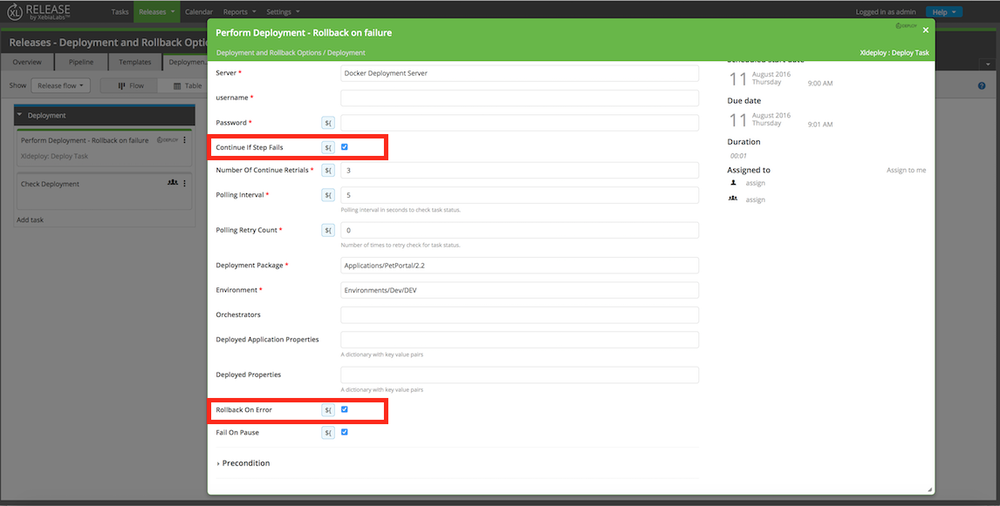
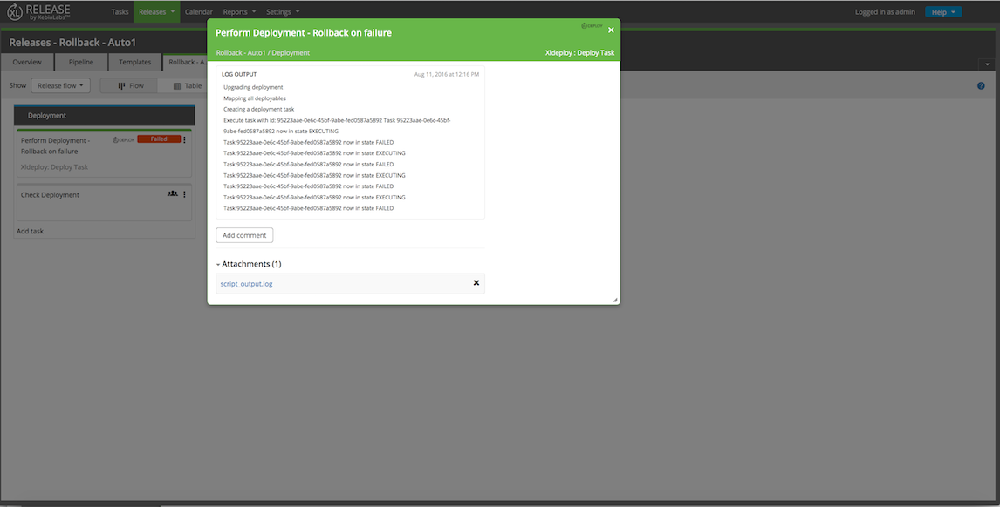
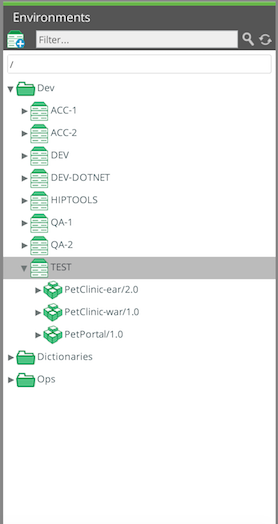
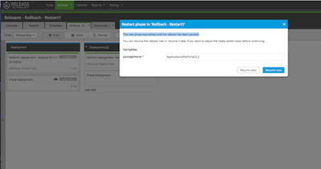
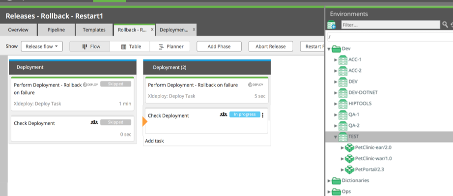

Handling failures is a key part of administering deployments. XL Release and XL Deploy offer key features to ensure that you can always reach a known state.

XL Release manages this by allowing you to define procedures to handle the situations you face regularly and interact appropriately with your deployment tooling.

XL Deploy maintains the state in your target environments and encourages you to create deployment packages in such a way that you can deploy any version to any target environment and let XL Deploy handle how it moves from one state to the next.

This topic explains two approaches for performing deployment rollbacks using XL Release and XL Deploy:

* Technical rollbacks
* Functional rollbacks

## Types of rollback

When a deployment fails, you have several options in the XL Deploy GUI:

* Continue the deployment by retrying the failed step
* Roll back the part of the deployment that succeeded
* Continue the deployment by skipping the failed step
* Cancel the deployment without rolling back

The first two options (continuing the deployment and rolling it back) leave the system in a known state. The final two options require an administrator to ensure that the target environment is restored to the expected state.

To fully automate rollback behavior, the failure modes and desired state must be known. A tool such as XL Release can be set up to provide an automated route to a known state. The [XL Deploy plugin for XL Release](https://github.com/xebialabs-community/xlr-xldeploy-plugin) provides fine-grained control of deployment actions which cater for many failure scenarios.

The alternative is a "fix-forward" approach in which a subsequent release of the software is deployed successfully, taking the environment to an even later version of the application.

## Technical rollbacks

If a deployment failure is technical in nature and your deployment tool supports retry attempts, a retry can be performed. The XL Deploy plugin for XL Release can optionally retry a number of times to overcome transient errors (such as a network outage).

If that fails, the plugin can be configured to roll back the deployment attempt, so that the target environment is left as it was prior to the deployment attempt.

### Sample automatic rollback

This example shows how the XL Deploy plugin for XL Release automatically rolls back a failed update of the PetPortal application from version 1.0 to version 2.2.

This is the configuration of the XL Deploy task in XL Release:

After the release reaches the task and XL Deploy starts executing the deployment, the deployment fails. This causes XL Release to mark the task as failed.

The `script_output.log` file attached to the task shows the following log messages:

	Upgrading deployment 
	Mapping all deployables 
	Creating a deployment task 
	Execute task with id: 95223aae-0e6c-45bf-9abe-fed0587a5892
	Task 95223aae-0e6c-45bf-9abe-fed0587a5892 now in state EXECUTING 
	Task 95223aae-0e6c-45bf-9abe-fed0587a5892 now in state FAILED 
	Task 95223aae-0e6c-45bf-9abe-fed0587a5892 now in state EXECUTING 
	Task 95223aae-0e6c-45bf-9abe-fed0587a5892 now in state FAILED 
	Task 95223aae-0e6c-45bf-9abe-fed0587a5892 now in state EXECUTING 
	Task 95223aae-0e6c-45bf-9abe-fed0587a5892 now in state FAILED 
	Task 95223aae-0e6c-45bf-9abe-fed0587a5892 now in state EXECUTING 
	Task 95223aae-0e6c-45bf-9abe-fed0587a5892 now in state FAILED 
	
	... DEPLOYMENT STEPS SHOWN HERE ...      
	
	Going to rollback 
	
	Task 0f2818c2-2595-4c86-acd9-89b570bdd23a now in state EXECUTING 
	
	Task 0f2818c2-2595-4c86-acd9-89b570bdd23a now in state EXECUTED 

This leaves the target environment in its original state, with PetPortal 1.0 deployed:

## Functional rollbacks

XL Release allows you to [restart a phase in an active release](/xl-release/how-to/restart-a-phase-in-an-active-release.html). If there is a functional failure that must be corrected by a deployment of a different version of the application, you can do so by restarting the phase that contains the deployment task. This is the "fix-forward" approach.

For example, say PetPortal is upgraded from version 1.0 to version 2.2, but there is a functional failure that will be fixed by PetPortal 2.3. First, the deployment phase is restarted:

At this time, you can specify the new deployment package for PetPortal 2.3. The resulting deployment succeeds:

## Automating failure handling

XL Release supports several approaches to automating failure handling. For detailed information, refer to:

* [How to handle failures](/xl-release/how-to/handle-failures-in-tasks.html)
* [Implementing a custom failure handler](/xl-release/how-to/implement-a-custom-failure-handler.html)
