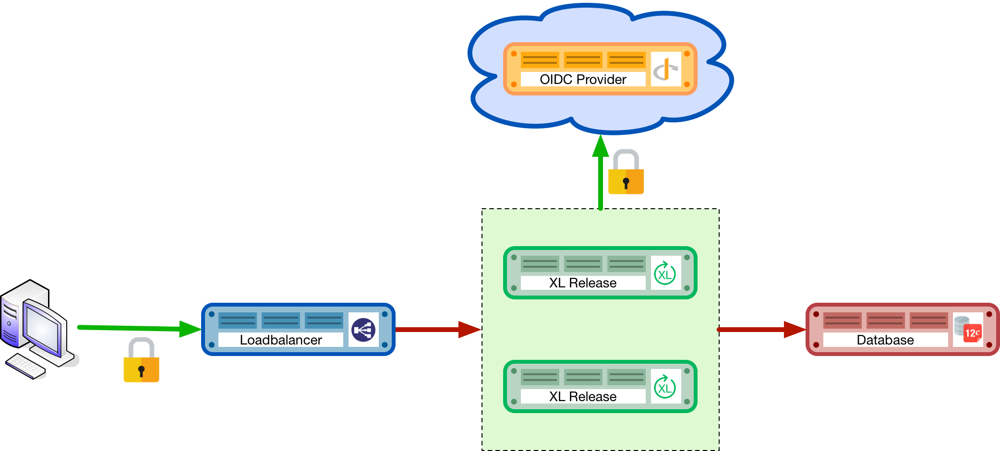

= How to set up XL Release in production
:sectnums:
:toc: right
:toclevels: 2
:page-liquid:
:page-categories: [xl-release]
:page-subject: Installation
:page-tags: [production, setup, installation]

== Introduction
This document provides a step-by-step implementation guide to set up XL Release in a production ready environment. It describes how to configure the product, environment and server resources to get the most out of the product. 

IMPORTANT: Proper configuration of I/O subsystems (database, file system, network) is critical for the optimal performance and operation of XL Release. This guide provides best practices and sizing recommendations.

This guide is broken up into several phases each covering several topics needed to know to install a production environment.

== Setup of production environment
This guide will describe how to setup a hardened production environment for XL Release. The setup that is described can be explained using the following deployment diagram:

In the above diagram you can see the following components from left to right:

- The user's computer: The user will initiate an SSL (secure) connection to the loadbalancer which fronts the clustered XL Release installation.
- The loadbalancer: The loadbalancer terminates the SSL connection and routes the request to the XL Release instance that the user is logged in to.
- The XL Release instances: The instances run in a clustered (Active/Active) setup, sharing the load.
- The OIDC (Open ID Connect) provider will authenticate users logging into the XL Release systems. Instead of an OIDC provider, XL Release also has support for LDAP(s).
- The Database: The (SQL) database that will host the repository of the XL Release instances.

== Structure of the document
This document is structured into 4 sections:

- Preparation
- Installation
- Administration / Operation

In the preparation section the prerequisites are described for the XL Release setup. In the installation section, the setup and configuration procedures for each of the components is described. In the administration section, best practices will be described to maintain and administer the system once it is in production.

== Preparation
The first phase of setting up the production environment consists of determining the correct hardware requirements and obtaining all the necessary prerequisites.

=== Obtaining the XL-Release servers
In the link:../concept/requirements-for-installing-xl-release.html[requirements for installing XL Release] guide, the minimal system requirements are defined on which XL Release can run. For a production setup we recommend the following setup for each production XL Release machine:

Hardware requirements XL Release servers:

- **3+ Ghz 2 CPU Quad-core** machine (amounting to 8 cores) or better.
- **16 GB RAM** or more
- **500GB** harddisk space

XebiaLabs has performance tested XL Release 7.5.0 with a similar setup. In this setup a

NOTE: TODO expand performance data

NOTE: All the XL Release cluster nodes _should_ reside in the same network segment. This is required for the clustering protocol to function correctly. For optimal performance it is also recommended to put the database server in the same network segment to minimize network latency.

=== Choosing your database server
For a production setup you need to use an external (clustered) database to store both the active as well as the archived data of XL Release. You have the choice of the following database to store the repository in:

- Oracle 11g
- Oracle 12c
- PostgreSQL versions 9.3, 9.4, 9.5, 9.6, and 10.1
- MySQL versions 5.5, 5.6, and 5.7
- Microsoft SQL Server 2012 and later
- DB2 versions 10.5 and 11.1

Please refer to the relevant documentation of the database server of your choice for hardware recommendations.

=== Choosing your loadbalancer
In order to run an HA setup of XL Release, you need to front the installation with a loadbalancer so that users are unaware of which of the clustered nodes they're being routed to. The example configuration given in this document is for HAProxy.
However any HTTP(s) loadbalancer that supports the following features is supported for following this guide:

- SSL offloading
- Checking a custom HTTP endpoint for node availability
- Sticky sessions

Loadbalancers that support this feature set are (not limited to):

- link:https://www.citrix.com/products/netscaler-adc/[Citrix NetScaler]
- link:https://f5.com/products/big-ip[F5 BIG-IP]
- link:http://www.haproxy.org/[HAProxy]

=== Choosing your authentication provider
XL Release has support for a number of (SSO) authentication providers. In its most basic form, there is support for LDAPS (Secure LDAP). However for modern environments, there is also support for authentication through an link:http://openid.net/connect/[OIDC provider].

A large number of cloud providers have support for authenticating through OIDC:

- link:https://developers.google.com/identity/protocols/OpenIDConnect[Google Identity Platform]
- link:https://docs.microsoft.com/en-us/azure/active-directory/develop/active-directory-protocols-openid-connect-code#register-your-application-with-your-ad-tenant[Microsoft Azure Active Directory (Office 365)]
- link:https://developer.okta.com/docs/api/resources/oidc.html#openid-connect-api[OKTA Identity provider]

If you don't want to depend on a cloud provider, or your SSO solution is not compatible with OIDC, it is possible to integrate your SSO with link:http://www.keycloak.org[Keycloak], which is an OIDC bridge.

=== Choosing your proactive monitoring and alerting solution
For a production installation XebiaLabs recommends setting up a proactive monitoring system to monitor system and product performance for the different parts of your installation. XL Release exposes internal and system metrics over JMX. Any monitoring system that can read JMX data can be used to monitor the installation.

Typical monitoring and alerting tools that can be hooked up to XL Release are:

- link:https://www.nagios.org/[Nagios]
- link:https://www.dynatrace.com/[Dynatrace]
- link:https://www.appdynamics.com/[AppDynamics]

These tools allow to monitor the product and the systems it is running on in real time. This will allow you to set thresholds and alert on them so that appropriate action can be taken before a system goes down.

=== Choosing your forensic data gathering toolchain
Next to doing proactive monitoring, for a production installation it is good practice to have data gathering available. When gathering forensic data you can analyze this at a later point in time. This gathered data can be used to determine root cause analysis for outages. It can also be used to determine usage patterns or peak load patterns.

For this kind of monitoring a timeseries database is typically used. XL Release can be hooked up to either:

- link:https://www.influxdata.com/time-series-platform/influxdb/[InfluxDB]
- link:https://prometheus.io/[Prometheus]

The gathered data can then be graphed and analyzed using tools such as link:https://grafana.com[Grafana]

Next to system monitoring, another set of tools that are useful for forensic data analysis is the ELK stack. This is an industry standard stack used to provide log file monitoring and analysis. The stack consists of the following 3 tools:

- link:https://elastic.co[Elasticsearch]
- link:https://www.elastic.co/products/logstash[Logstash]
- link:https://www.elastic.co/products/kibana[Kibana]

Using these tools, logfiles can be read and indexed while they're being written, so that they can be easily analyzed during a root cause analysis for a production outage.

== Execution phase
Once all the machines in the production environment are available, XL Release and subsystems can be installed and activated.

=== Setting up the database server
XL Release requires two separate schemas in the target database platform. Typically schemas are tied to users by default. XL Release will use the main schema to store its active data in. The second schema is used to store the compliance / archived (immutable) data in.

For this guide we will create the following users and schemas:

- `xlrelease`: This will be the user/schema for the active release data.
- `xlrarchive`: This will be the user/schema for the compliance release data. This schema will over time grow in size.

For some of the databases some extra configuration options need to be set for them to be supported or to perform better.

==== DB2
XL Release requires that DB2 is set in MySQL compatible mode in order for it to support the pagination queries. Please run the following command on your DB2 database to enable this:

[source,console]
----
$ db2set DB2_COMPATIBILITY_VECTOR=MYS
$ db2stop
$ db2start
----

==== MySQL / MariaDB
The default installation of MySQL is not tuned to be run on a dedicated high-end machine. XebiaLabs recommends changing the following settings of MySQL to improve its performance. These settings can be set in the MySQL options file. See the link:https://dev.mysql.com/doc/refman/5.7/en/option-files.html[MySQL documentation] to locate this file on your operating system.

The following settings are required to set for correct operation on MySQL:

[cols="^.<,<.<2",options="header"]
|===
| Setting | Value
| `skip-character-set-client-handshake` |
| `collation_server` | `utf8_unicode_ci`
| `character_set_server` | `utf8`
|===

The below settings are used to improve performance when running on MySQL

[cols="^.<,<.<2",options="header"]
|===
| Setting | Value
| `innodb_buffer_pool_size` | XebiaLabs recommends setting this to 70-75% of the available RAM of the database server, but not higher. This setting controls how much of the database structure can be kept in memory. The larger it is, the better performant the application will be due to caching at the database level.
| `innodb_log_file_size` | XebiaLabs recommends setting this to `256M`. This setting controls how much redo logs MySQL keeps. This setting should be set large enough so that MySQL can smooth out peak loads by keeping transactions in the redo log.
| `innodb_thread_concurrency` | XebiaLabs recommends setting this to `2 * CPU cores` of the database server. So for a 2 CPU Quad-core machine, this setting should be set to `2 CPU * 4 Cores * 2 = 16`.
| `max_allowed_packet` | XebiaLabs recommends setting this value to `16M`. This setting controls how large the packet can be that the server transmits to the client. As the XL Release database for some columns works with BLOBs, this setting is recommended over the default of `1M`.
| `open_files_limit` | XebiaLabs recommends setting this value to `10000` for large installations. This setting controls how many file descriptors the MySQL database can keep open. This setting cannot be configured higher than the output of `ulimit -n` on a Linux/Unix system. Please refer to the documentation of your operating system if this limit is lower than the recommended value.
| `innodb_flush_log_at_trx_commit` a| **Advanced**: The default setting of this option is `1` which means that every transaction is always flushed to disk on commit, ensuring full ACID compliance. Setting this to either `0` (only flush the transaction buffer once per second to the transaction log), or `2` (directly write the transaction to the transaction log, flush the log once per second to disk), can lead to transaction loss of up to a second worth of data.

When using battery backed disk-cache, this setting can be set to `2` to prevent direct flushes to disk. The battery backed disk-cache will then ensure that the cache is flushed to disk before the power fails.
|===

==== PostgreSQL
There are a number of settings in a default installation of PostgreSQL that can be tuned to better perform on higher end systems. These configuration options can be set in the PostgreSQL configuration file. See the link:https://www.postgresql.org/docs/9.6/static/runtime-config-file-locations.html[PostgreSQL documentation] to locate this file on your operating system.

[cols="^,2",options="header"]
|===
| Setting | Value
| `shared_buffers` | XebiaLabs recommends setting this to 30% of the available RAM of the database server. This setting controls how much memory is dedicated to PostgreSQL to use for caching data.
| `effective_cache_size` | XebiaLabs recommends setting this to 50% of the available RAM of the database server. This setting provides an estimate of how much memory is available for disk caching. The PostgreSQL query planner uses this to figure out whether query plan results would fit in memory or not.
| `checkpoint_segments` | Xebialabs recommends setting this to `64`. This setting controls how often the Write Ahead Log (WAL) is checkpointed. The WAL is written in 16MB segments. Setting this to `64` means that either once every `64 * 16MB = 1024MB` or once per 5 minutes the WAL is checkpointed, whichever is reached first.
| `default_statistics_target` | XebiaLabs recommends setting this to `250`. This setting controls the amount of information stored in the statistics tables for optimizing query execution.
| `work_mem` | XebiaLabs recommends setting this to 0.2% of the available RAM of the database server. This setting controls how much memory is available per connection for doing in memory sorts and joins of query results. In a 100 connection scenario this will amount to 20% of the available RAM in total.
| `maintenance_work_mem` | XebiaLabs recommends setting this to 2% of the available RAM. This setting controls the amount of memory available to PostgreSQL for maintenance operations such as VACUUM and ANALYZE.
| `synchronous_commit` | **Advanced**: The default setting of this option is `on`, this guarantees full ACID compliance and no data-loss on power failure. If you have a battery-backed disk cache, you can switch this setting to `off` to get an increase in transactions per second.
|===

==== Microsoft SQL Server
Unlike other supported databases, MS SQL Server does not have Multi Version Concurrency Control activated by default. XL Release requires this to function correctly. For more information on the settings described below, please refer to link:https://msdn.microsoft.com/en-us/library/ms189050.aspx[this MSDN article].

Enable snapshot isolation mode with the following commands executed against SQL Server:

    ALTER DATABASE xlrelease SET ALLOW_SNAPSHOT_ISOLATION ON;
    ALTER DATABASE xlrelease SET READ_COMMITTED_SNAPSHOT ON;
    ALTER DATABASE xlarchive SET ALLOW_SNAPSHOT_ISOLATION ON;
    ALTER DATABASE xlarchive SET READ_COMMITTED_SNAPSHOT ON;

When this is enabled, you need to add a weekly maintenance task to MS SQL Server. This is described in the <<Maintenance on Microsoft SQL Server>> Administration section of this document.

=== Setting up the XL Release nodes
As XL Release has the potential of running both remote and local script tasks, you need to take care to harden the XL Release environment from (accidental) abuse. There are many industry standard practices to ensure that an application is running in a sandboxed environment. At the very least we recommend taking the following actions:

==== Operating system and Java
XL Release supports both Microsoft Windows and Linux/Unix operating systems to run on. Any 64-bit version of Windows works. Ensure that whichever Operating System you run, you are always running the latest security updates.

CAUTION: XL Release is not supported on **Java9**, ensure you have a **Java8** installation available.

XL Release requires **Java8**. Both the Oracle JDK or JRE, as well as OpenJDK are supported. Again, please always run the latest patch level of the JDK/JRE unless otherwise instructed.

==== Obtaining the XL Release distribution
XL Release comes in two different versions:

- __Long-Term Support (LTS)__ versions are supported for a year after they've been superseded by the next major LTS release. A major new version is released every 6 months, with maintenance releases in between.
- __Short-term support (STS)__ versions are supported until they are superseded by the next LTS or STS version. Maintenance releases are not created for STS versions.

XebiaLabs recommends that your production environment always runs the latest maintenance release of the LTS version. You can find the versions and their support cycle on the following link:https://support.xebialabs.com/hc/en-us/articles/115003299946-Supported-XebiaLabs-product-versions[support page].

You can obtain the installation of XL Release from the XebiaLabs link:https://dist.xebialabs.com/customer/xl-release[distribution server].

==== Installation
This section describes how to install XL Release on the machines so that it is installed with minimum rights.

. Create a dedicated _non-root_ user called `xl-release`. This ensures that you can lock down the operating system and prevents accidental privilege escalations.
. Create a directory under `/opt` called `xebialabs`, where the `xl-release` user has _read_ access.
. Extract the downloaded version of XL Release in the `/opt/xebialabs` directory.
. Change the ownership of the installed product to `xl-release`, and grant the user _read_ access to the installation directory.
. Grant the `xl-release` user _write_ access to the `/opt/xebialabs/xl-release-<version>-server/conf` and `/opt/xebialabs/xl-release-<version>-server/log` directories.
. Copy your license file, obtained from link:https://dist.xebialabs.com/customer/license[the XebiaLabs distribution site] to the `/opt/xebialabs/xl-release-<version>-server/conf` directory.

==== Configuration of the SQL Repository
For a clustered production setup XL Release requires that an external database is configured. This is documented in the following guide:

- link:configure-the-xl-release-sql-repository-in-a-database.html[How to configure the XL Release SQL repository in a database]

==== Configuration of the XL Release clustering
To configure XL Release in a clustered active/active setup, please read the following guide:

- link:configure-cluster.html[How to configure cluster mode]

For a production setup, please set the clustering mode to either `full` or `hot-standby`. The difference is that in `hot-standby` mode only _1_ node is active at any given moment, the other node(s) are marked as offline in the loadbalancer and will not receive any HTTP traffic. In `full` cluster mode, the cluster is running in an active/active manner. This means that all nodes are available in the loadbalancer and traffic is shared between them.

NOTE: Please ensure that you choose the same cluster mode for _all_ nodes in the cluster. It is not possible to mix them.

==== Configuration of user authentication
Next to the cluster and database configuration, you will also need to setup a secure way of authenticating the user. For production setups, XebiaLabs recommends using either an OIDC provider, or an LDAP directory system over the **LDAPS** protocol. For setting these up, please refer to the following configuration guides:

- link:../concept/xl-release-oidc-authentication.html[Configure Open ID Connect authentication for XL Release]
- link:configure-ldap-security-for-xl-release.html[Configure LDAP security for XL Release]

==== Configuration of the XL Release JVM options
By default XL Release is configured to provide a good out of the box trial experience. For optimal production use, the runtime configuration of XL Release needs to be configured. XebiaLabs recommends adding/changing the following settings in the `conf/xlr-wrapper-linux.conf` or the `conf/xlr-wrapper-windows.conf`

[cols="^,2",options="header"]
|===
| Setting | Value
| `-server` | Instructs the JVM to run in the server profile
| `-Xms8192m` | Instructs the JVM to reserve a minimum of 8GB of Heap space
| `-Xmx8192m` | Instructs the JVM to reserve a maximum of 8GB of Heap space
| `-XX:+UnlockExperimentalVMOptions` | Instructs the JVM to unlock experimental options
| `-XX:MaxMetaspaceSize=1024m` | Instructs the JVM to assign 1GB of memory to the Metaspace region (off-heap memory region for loading classes and native libraries)
| `-Xss1024k` | Instructs the JVM to limit the stack size to 1MB
| `-XX:+UseG1GC` | Instructs the JVM to use the new G1 (Garbage First) Garbage Collector. As of Java9 this will be the default GC.
| `-Dsun.net.inetaddr.ttl=60` |
| `-XX:+HeapDumpOnOutOfMemoryError` | Instructs the JVM to dump the heap to a file in case of an OutOfMemoryError. This is useful for debugging purposes after the XL Release process has crashed.
| `-XX:HeapDumpPath=log/` | Instructs the JVM to store the generated heap dumps to the `log/` directory of the XL Release server.
|===

==== Extra production configuration options
The following are extra settings that are not part of the other setup guides that XebiaLabs recommends to configure for production installations:

[cols="^,1,3",options="header"]
|===
| Setting | File | Value
| `xl.metrics.enabled` | `xl-release.conf` | XebiaLabs recommends to set this to `true` so that the XL Release system can be monitored using monitoring tools. Metrics will then be exposed over JMX
|===

==== Finalizing the node configuration
Now that the node(s) are configured for production use, their configuration needs to be finalized. For this, please execute the following on just a single node:

. Start up the server using the `/opt/xebialabs/xl-release-<version>-server/bin/run.sh` or `/opt/xebialabs/xl-release-<version>-server/bin/run.bat` script.

Because this is the initial install, XL Release will start with asking a number of questions, please follow the next steps to provide the answers to these questions:

[cols="2,1,3",options="header"]
|===
| Question | Answer | Explanation
| Do you want to use the simple setup | no | Some of the properties need to be changed for production scenarios
| Please enter the admin password | ... | Choose a sufficiently difficult admin password
| Do you want to generate a new password encryption key | yes | XebiaLabs recommends generating a random unique password encryption key for the production environment
| Please enter the password you wish to use for the password encryption key | ... | If you want to start XL Release as a service on system boot, XebiaLabs recommends not adding a password to the password encryption key. This prevents automated start. If your enterprise security compliance demands it, it is possible to add a password now.
| Would you like to enable SSL | no | SSL offloading is done on the loadbalancer so that session stickiness can be enabled. There is no need in this scenario to enable SSL on the XL Release servers.
| What HTTP bind address would you like the server to listen to | 0.0.0.0 | Add this to listen on all interfaces. If you only want to listen on a single IP address / interface, enter that one
| What HTTP port number would you like the server to listen on | 5516 | This is the default port, it is possible to enter an different port number.
| Enter the web context root where XL Release will run | / | By default XL Release runs on the `/` context root, i.e. in the root of the server.
| Enter the public URL to access XL Release | https://<HOSTNAME_OF_LOADBALANCER> | In order for XL Release to correctly rewrite all the URLs it needs to be aware how it is reachable. Please fill out the IP address or hostname configured on the loadbalancer, instead of the IP address (and port) of the XL Release server itself. The protocol that needs to be entered here is _https_.
| Enter the minimum number of threads for the HTTP server | 30 | Unless otherwise instructed, the default value can be used here
| Enter the maximum number of threads for the HTTP server | 150 | Start with the default value. If monitoring points to threadpool saturation, this number can be increased.
| Do you agree with these settings | yes | Type 'yes' after reviewing all the settings
|===

. After entering 'yes' to the final question, the XL Release server will boot up. During the initialization sequence it will initialize the database schemas after which it will display

    You can now point your browser to https://<IP_OF_LOADBALANCER>/

. Stop the XL Release server
. Edit the `conf/xl-release-server.conf` file and change/add configuration options not asked during the setup procedure

[cols="2,1,3",options="header"]
|===
| Option | Value | Explanation
| `hide.internals` | `true` | Setting this to true, hides exception messages from the end-users and only presents them with a key using which the XL Release administrator can find the exception
| `client.session.timeout.minutes` | 20 | This setting defines the session idle timeout. Set this to the amount of minutes that is defined by your enterprise security compliance department.
|===

. Copy the `conf/repository-keystore.jceks` and `conf/xl-release-server.conf` to the other nodes so that they run on the same settings.

All nodes are now fully configured and can be booted up.

==== Boot sequence
Now that all XL Release nodes are configured, we can start them up. In order to do this, please follow the following steps:

. Start the first node.
. Wait until the node is reachable on `http://<node_ip_address>:5516/`.
. When the node is reachable, boot the other node(s).
. In case of `full` cluster mode, check that every node reports success on a GET request to `http://<node_ip_address>:5516/ha/health`
. In case of `hot-standby` cluster mode, check that only the first node reports success on a GET request to `http://<node_ip_address>:5516/ha/health`. All other nodes should report http status code `503 Service Unavailable`.

=== Setting up the loadbalancer
In this guide we will use HAProxy to setup a loadbalancer configuration, and explain the settings that you need to set.

You can download the full link:production-setup/haproxy.cfg[HAProxy configuration file] here. The sections copied below are the ones that show how to set up the routing and health checks for the loadbalancer. The provided configuration is usable for XL Release in both `full` and `hot-standby` cluster modes.

[source]
----
frontend xl-http // <1>
  bind 0.0.0.0:80
  reqadd X-Forwarded-Proto:\ http
  default_backend xl-backend

frontend xl-https // <3>
  bind 0.0.0.0:443 ssl crt /etc/ssl/certs/certificate.pem // <4>
  reqadd X-Forwarded-Proto:\ https
  option httplog
  log global
  default_backend xlr-backend // <5>

backend xl-backend // <2>
  redirect scheme https if !{ ssl_fc }

backend xlr-backend // <6>
  option httpchk GET /ha/health // <7>
  balance roundrobin // <8>
  cookie JSESSIONID prefix // <9>
  server xlr-1 xl-release1.acme.com:5516 check cookie xlr-1 // <10>
  server xlr-2 xl-release2.acme.com:5516 check cookie xlr-2
----

<1> The `xl-http` frontend routes all HTTP requests coming in on port 80 to the `xl-backend` backend.
<2> The `xl-backend` backend will redirect all requests to HTTPS if the front connection was not made using an SSL transport layer.
<3> The `xl-https` frontend will handle all incoming SSL requests on port 443.
<4> Ensure you have a properly signed certificate here to ensure a hardened configuration
<5> Every incoming request on HTTPS will be routed to the `xlr-backend` backend
<6> The `xlr-backend` will handle the actual loadbalancing for the XL Release nodes.
<7> Every XL Release node is checked on the `/ha/health` endpoint to verify whether it is up. If this endpoint returns a non-success status code, the node is taken out of the loadbalancer until it is back up.
<8> The loadbalancer is configured to `roundrobin` mode, i.e. every new user gets assigned a different node than the previous user if there is more than 1 node available.
<9> The XL Release cookie that is used for the session stickiness (ensuring a user always ends up on the same node in a single session) is the `JSESSIONID` cookie. The loadbalancer will add a `prefix` to that cookie so that it can remember which node the user needs to be routed to.
<10> This line defines that the server `xl-release1.acme.com` lives on port 5516. It needs to be `check`-ed for aliveness, and the cookie-prefix is `xlr-1`.

=== Setting up monitoring

==== What to monitor
For a production setup, XebiaLabs recommends monitoring at the very least the following statistics of all of the systems involved (i.e. the loadbalancer, XL Release nodes and Database server(s)):

- Network I/O
- Disk I/O
- RAM usage
- CPU usage

In the previous section we've enabled the `xl.metrics.enabled` configuration flag. This activates the JMX monitoring of the XL Release nodes. The important JMX beans to monitor are:

[cols="^,2",options="header"]
|===
| Metric | Description
| `com.xebialabs.xlrelease.metrics.api.internal` | Statistics about non-public API endpoints
| `com.xebialabs.xlrelease.metrics.api.v1` | Statistics about public API endpoints
| `com.xebialabs.xlrelease.metrics.repository` | Statistics about the persistence application layer
| `com.xebialabs.xlrelease.metrics.service` | Statistics about the service application layer
| `com.xebialabs.xlrelease.metrics.executors.scheduler` | Statistics about the background tasks thread pool
| `com.xebialabs.xlrelease.metrics.releaseTrigger` | Statistics about the triggers thread pool
| `com.xebialabs.xlrelease.metrics.riskCalculation` | Statistics about the risk calculation thread pool
| `com.xebialabs.xlrelease.metrics.pool.repository` | Statistics about the database connection pool
| `com.xebialabs.xlrelease.metrics.repository` | Statistics about the persistence application layer
|===

==== Adding monitoring to XL Release
It is possible to either (remotely) monitor JMX, add a java agent such as the Dynatrace agent, or use a tool like _collectd_ to push the monitoring statistics to a central collectd server.

There are pros and cons to each of these. In general, XebiaLabs does not recommend adding Java agents to the Java process. From our own testing it has been shown that these can adversely influence the performance characteristics of the XL Release system. Furthermore we do not recommend exposing insecure / unauthenticated JMX over the network as that can be used to execute remote procedure calls on the JVM.

We recommend setting up link:https://collectd.org[collectd] to aggregate the statistics on the XL Release server, and push them to a central collecting server that can graph these statistics. In order to do this, you have to install the following tools on the XL Release server:

- link:https://collectd.org[collectd]
- link:https://collectd.org/wiki/index.php/Plugin:Java[collectd-java]
- link:https://github.com/egineering-llc/collectd-fast-jmx[FastJMX]

Once these tools are installed, you can download a link:production-setup/collectd.conf[sample collectd.conf file] here which is preconfigured to monitor all the relevant XL Release application and system  statistics. In order to use this file, you will have to add 2 configuration values to the configuration.

- IP_ADDRESS_HERE: Fill out the IP address of the central collectd server here.
- NETWORK_INTERFACE_HERE: Add the network interface over which XL release communicates here.

== Administration / Operation
This section describes how to maintain the system once it's up, and what to do if monitoring shows erratic behavior.

TODO...

=== Maintenance on Microsoft SQL Server
When running on MS SQL Server, because of the snapshot isolation mode you will need to run a set of weekly (or more frequent) maintenance tasks on the database in order to keep the performance on an acceptable level.

- recompute statistics by running `EXEC sp_updatestats`
- clear buffers by running `DBCC DROPCLEANBUFFERS`
- clear cache by running `DBCC FREEPROCCACHE`
- rebuild indexes that are fragmented more than 30%
