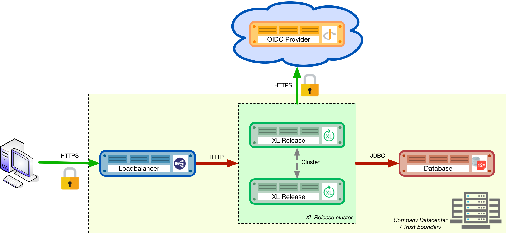

= How to set up XL Release in production
:sectnums:
:toc: right
:toclevels: 2
:page-liquid:
:page-categories: [xl-release]
:page-subject: Installation
:page-tags: [production, setup, installation]

== Introduction
This is a step-by-step implementation guide to set up XL Release in a production-ready environment. It describes how to configure the product, environment, and server resources to get the most out of the product. This document is structured in three sections:

- Preparation: Describes the prerequisites for the prescribed XL Release setup.
- Installation: Covers setup and configuration procedures for each of the components.
- Administration/Operation: Provides an overview of best practices to maintain and administer the system once it is in production.

IMPORTANT: Proper configuration of I/O subsystems (database, file system, network) is critical for the optimal performance and operation of XL Release. This guide provides best practices and sizing recommendations.

== Production environment setup
The hardened production environment setup for XL Release described in this guide is:

The diagram shows the following components from left to right:

- The user's computer: The user will initiate an SSL (secure) connection to the load balancer that fronts the clustered XL Release installation.
- The load balancer: The load balancer terminates the SSL connection and routes the request to the XL Release instance that the user is logged into.
- The XL Release instances: The instances run in a clustered (active/active) setup, sharing the load.
- The Open ID Connect (OIDC) provider authenticates users who are logging into the XL Release systems. XL Release supports both OIDC and LDAP.
- The database: The SQL database that hosts the repository of the XL Release instances.

== Preparation
In the first phase of setting up the production environment, you must determine the correct hardware requirements and obtain the necessary prerequisites.

=== Obtaining XL Release servers
link:../concept/requirements-for-installing-xl-release.html[Requirements for installing XL Release] defines minimal system requirements. The following is recommended for each production XL Release machine:

* 3+ Ghz 2 CPU quad-core machine (amounting to 8 cores) or better
* 16 GB RAM or more
* 500 GB hard disk space

XebiaLabs has performance tested XL Release 7.5.0 with a similar setup. In this setup a

NOTE: TODO expand performance data

NOTE: All the XL Release cluster nodes _should_ reside in the same network segment. This is required for the clustering protocol to function correctly. For optimal performance, it is also recommended that you put the database server in the same network segment to minimize network latency.

=== Choosing a database server
A production setup requires an external (clustered) database to store XL Release's active and archived data. The external databases that are supported is described in link:configure-the-xl-release-sql-repository-in-a-database.html[Configure the XL Release SQL repository in a database].

Please refer to the database server supplier's documentation for hardware recommendations.

=== Choosing a load balancer
To run a high-availability (HA) setup, you must front the installation with a load balancer so that users are unaware of which of the clustered nodes they are being routed to. This guide uses HAProxy as an example. However, any HTTP(s) load balancer that supports the following features can be used:

- SSL offloading
- Checking a custom HTTP endpoint for node availability
- Sticky sessions

For example, some load balancers that support this feature set are:

- link:https://www.citrix.com/products/netscaler-adc/[Citrix NetScaler]
- link:https://f5.com/products/big-ip[F5 BIG-IP]
- link:http://www.haproxy.org/[HAProxy]

=== Choosing an authentication provider
XL Release supports a number of single-sign on (SSO) authentication providers, including Secure LDAP (LDAPS) and link:http://openid.net/connect/[OIDC providers]. Many cloud providers support authentication through OIDC:

- link:https://developers.google.com/identity/protocols/OpenIDConnect[Google Identity Platform]
- link:https://docs.microsoft.com/en-us/azure/active-directory/develop/active-directory-protocols-openid-connect-code#register-your-application-with-your-ad-tenant[Microsoft Azure Active Directory (Office 365)]
- link:https://developer.okta.com/docs/api/resources/oidc.html#openid-connect-api[OKTA Identity provider]

If you do not want to use a cloud provider or if your SSO solution is not compatible with OIDC, you can integrate your SSO with link:http://www.keycloak.org[Keycloak], which is an OIDC bridge.

=== Choosing a proactive monitoring and alerting solution
For a production installation, it is recommended that you set up a proactive monitoring system to monitor system and product performance for the different parts of your installation. XL Release exposes internal and system metrics over JMX. Any monitoring system that can read JMX data can be used to monitor the installation.

Typical monitoring and alerting tools are:

- link:https://www.nagios.org/[Nagios]
- link:https://www.dynatrace.com/[Dynatrace]
- link:https://www.appdynamics.com/[AppDynamics]

These tools allow you to monitor the product and the systems it is running on in real time. This will allow you to set thresholds and alert on them so that appropriate action can be taken before a system goes down.

=== Choosing a forensic data gathering toolchain
In addition to proactive monitoring, it is good practice to make data gathering available for a production instance. Gathering forensic data enables you to analyze it at a later point in time and perform root cause analysis for outages. You can also use forensic data to determine usage patterns and peak load patterns.

For this kind of monitoring, a time series database is typically used. XL Release supports:

- link:https://www.influxdata.com/time-series-platform/influxdb/[InfluxDB]
- link:https://prometheus.io/[Prometheus]

You can graph and analyze the gathered data using a tool such as link:https://grafana.com[Grafana].

It is also recommended that you set up log file monitoring. The industry-standard toolchain for log file monitoring is the ELK stack:

- link:https://elastic.co[Elasticsearch]
- link:https://www.elastic.co/products/logstash[Logstash]
- link:https://www.elastic.co/products/kibana[Kibana]

These tools allow log files to be read and indexed while they are being written, so you can monitor for errant behavior during operation and perform analysis after outages.

== Execution phase
After all the machines in the production environment are available, you can install and activate XL Release and subsystems.

=== Setting up the database server
The basic database setup procedure, including schemas and privileges, is explained in link:configure-the-xl-release-sql-repository-in-a-database.html[Configure the XL Release SQL repository in a database]. However, for some databases, additional configuration options are required for use with XL Release or for better performance.

==== DB2
XL Release requires DB2 to be set in MySQL compatible mode so it can support pagination queries. Run the following command on your DB2 database to enable MySQL compatible mode:

[source,console]
----
$ db2set DB2_COMPATIBILITY_VECTOR=MYS
$ db2stop
$ db2start
----

==== MySQL or MariaDB
The default installation of MySQL is not tuned run on a dedicated high-end machine. It is recommended that you change the following MySQL settings to improve its performance. These settings can be set in the MySQL options file; see the link:https://dev.mysql.com/doc/refman/5.7/en/option-files.html[MySQL documentation] to locate this file on your operating system.

[cols="^,2",role="table table-striped table-bordered",options="header"]
|===
| Setting | Value
| `innodb_buffer_pool_size` | Set this to 70-75% of the available RAM of the database server, but not higher. This setting controls how much of the database structure can be kept in memory. The larger it is, the better performant the application will be due to caching at the database level.
| `innodb_log_file_size` | Set this to `256M`. This setting controls how much redo logs MySQL keeps. This setting should be set large enough so that MySQL can smooth out peak loads by keeping transactions in the redo log.
| `innodb_thread_concurrency` | Set this to `2 * CPU cores` of the database server. For example, for a 2 CPU quad-core machine, this setting should be set to `2 CPU * 4 Cores * 2 = 16`.
| `max_allowed_packet` | Set this to `16M`. This setting controls how large the packet can be that the server transmits to the client. As the XL Release database for some columns works with BLOBs, this setting is recommended over the default of `1M`.
| `open_files_limit` | XebiaLabs recommends setting this value to `10000` for large installations. This setting controls how many file descriptors the MySQL database can keep open. This setting cannot be configured higher than the output of `ulimit -n` on a Linux/Unix system. Please refer to the documentation of your operating system if this limit is lower than the recommended value.
| `innodb_flush_log_at_trx_commit` a| **Advanced**: The default setting of this option is `1` which means that every transaction is always flushed to disk on commit, ensuring full ACID compliance. Setting this to either `0` (only flush the transaction buffer once per second to the transaction log), or `2` (directly write the transaction to the transaction log, flush the log once per second to disk), can lead to transaction loss of up to a second worth of data.

When using a battery-backed disk cache, this setting can be set to `2` to prevent direct flushes to disk. The battery-backed disk cache will then ensure that the cache is flushed to disk before the power fails.
|===

==== PostgreSQL
There are a number of settings in a default installation of PostgreSQL that can be tuned to better perform on higher end systems. These configuration options can be set in the PostgreSQL configuration file; see the link:https://www.postgresql.org/docs/9.6/static/runtime-config-file-locations.html[PostgreSQL documentation] to locate this file on your operating system.

[cols="^,2",role="table table-striped table-bordered",options="header"]
|===
| Setting | Value
| `shared_buffers` | Set to 30% of the available RAM of the database server. This setting controls how much memory is dedicated to PostgreSQL to use for caching data.
| `effective_cache_size` | Set to 50% of the available RAM of the database server. This setting provides an estimate of how much memory is available for disk caching. The PostgreSQL query planner uses this to figure out whether query plan results would fit in memory or not.
| `checkpoint_segments` | Set to `64`. This setting controls how often the Write Ahead Log (WAL) is checkpointed. The WAL is written in 16MB segments. Setting this to `64` means that the WAL is checkpointed once every `64 * 16MB = 1024MB` or once per 5 minutes, whichever is reached first.
| `default_statistics_target` | Set to `250`. This setting controls the amount of information stored in the statistics tables for optimizing query execution.
| `work_mem` | Set to 0.2% of the available RAM of the database server. This setting controls how much memory is available per connection for doing in memory sorts and joins of query results. In a 100 connection scenario this will amount to 20% of the available RAM in total.
| `maintenance_work_mem` | Set to 2% of the available RAM. This setting controls the amount of memory available to PostgreSQL for maintenance operations such as VACUUM and ANALYZE.
| `synchronous_commit` | **Advanced**: The default setting of this option is `on`, this guarantees full ACID compliance and no data loss on power failure. If you have a battery-backed disk cache, you can switch this setting to `off` to get an increase in transactions per second.
|===

=== Setting up the XL Release nodes
As XL Release has the potential of running both remote and local script tasks, it is important to harden the XL Release environment from abuse. There are many industry-standard practices to ensure that an application runs in a sandboxed environment. You should at least take the following actions.

==== Operating system and Java
XL Release can run on both Microsoft Windows (64-bit) and Linux/Unix operating systems. Ensure that the latest security updates are always applied to the operating system.

CAUTION: XL Release requires Java 8. Running XL Release on Java 9 is not supported.

XL Release can run on the Oracle JDK or JRE, as well as OpenJDK. Always run the latest patch level of the JDK or JRE unless otherwise instructed.

==== Obtaining the XL Release distribution
Download XL Release from the link:https://dist.xebialabs.com/customer/xl-release[XebiaLabs Software Distribution site] (requires customer log-in).

For information about supported versions of XL Release, refer to link:https://support.xebialabs.com/hc/en-us/articles/115003299946-Supported-XebiaLabs-product-versions[Supported XebiaLabs product versions].

==== Installation
To install XL Release on the machines with minimum rights:

1. Create a dedicated _non-root_ user called `xl-release`. This ensures that you can lock down the operating system and prevents accidental privilege escalations.
2. Create a directory under `/opt` called `xebialabs`, where the `xl-release` user has _read_ access.
3. Extract the downloaded version of XL Release in the `/opt/xebialabs` directory.
4. Change the ownership of the installed product to `xl-release` and grant the user _read_ access to the installation directory.
5. Grant the `xl-release` user _write_ access to the `/opt/xebialabs/xl-release-<version>-server/conf` and `/opt/xebialabs/xl-release-<version>-server/log` directories.
6. Copy your license file to the `/opt/xebialabs/xl-release-<version>-server/conf` directory. You can download your license file from the link:https://dist.xebialabs.com/customer/license[XebiaLabs Software Distribution site] (requires customer log-in).

==== Configure the SQL repository
For a clustered production setup, XL Release requires an external database, as described in link:configure-the-xl-release-sql-repository-in-a-database.html[How to configure the XL Release SQL repository in a database].

==== Configure XL Release clustering
To configure XL Release in a clustered active/active setup, refer to link:configure-cluster.html[How to configure cluster mode].

For a production setup, please set the clustering mode to either `full` or `hot-standby`. The difference is that in `hot-standby` mode only _1_ node is active at any given moment, the other node(s) are marked as offline in the load balancer and will not receive any HTTP traffic. In `full` cluster mode, the cluster is running in an active/active manner. This means that all nodes are available in the load balancer and traffic is shared between them.

NOTE: Please ensure that you choose the same cluster mode for _all_ nodes in the cluster. It is not possible to mix them.

==== Configure user authentication
In addition to configuring the cluster and database, you should also set up a secure way of authenticating users. For production setups, it is recommended that you use OIDC provider, Keycloak, or an LDAP directory system over the **LDAPS** protocol. For more information, refer to:

- link:../concept/xl-release-oidc-authentication.html[Configure Open ID Connect authentication for XL Release]
- link:configure-ldap-security-for-xl-release.html[Configure LDAP security for XL Release]

==== Configure XL Release JVM options
By default, XL Release is configured to provide a good out-of-the-box trial experience. For optimal production use, the runtime configuration of XL Release should be configured. It is recommended that you add or change the following settings in the `conf/xlr-wrapper-linux.conf` or the `conf/xlr-wrapper-windows.conf` file.

[cols="^,2",role="table table-striped table-bordered",options="header"]
|===
| Setting | Value
| `-server` | Instructs the JVM to run in the server profile.
| `-Xms8192m` | Instructs the JVM to reserve a minimum of 8 GB of heap space.
| `-Xmx8192m` | Instructs the JVM to reserve a maximum of 8 GB of heap space.
| `-XX:+UnlockExperimentalVMOptions` | Instructs the JVM to unlock experimental options.
| `-XX:MaxMetaspaceSize=1024m` | Instructs the JVM to assign 1 GB of memory to the metaspace region (off-heap memory region for loading classes and native libraries).
| `-Xss1024k` | Instructs the JVM to limit the stack size to 1 MB
| `-XX:+UseG1GC` | Instructs the JVM to use the new G1 (Garbage First) garbage collector. As of Java9, this will be the default garbage collector.
| `-Dsun.net.inetaddr.ttl=60` |
| `-XX:+HeapDumpOnOutOfMemoryError` | Instructs the JVM to dump the heap to a file in case of an OutOfMemoryError. This is useful for debugging purposes after the XL Release process has crashed.
| `-XX:HeapDumpPath=log/` | Instructs the JVM to store generated heap dumps in the `log/` directory of the XL Release server.
|===

==== Additional production configuration options
In addition to settings above, it is recommended that you configure the following settings for production installations:

[cols="^,1,3",role="table table-striped table-bordered",options="header"]
|===
| Setting | File | Value
| `xl.metrics.enabled` | `xl-release.conf` | Set to `true` so that the XL Release system can be monitored using monitoring tools. Metrics will be exposed over JMX.
|===

==== Finalize the node configuration
After the node(s) are configured for production use, their configuration needs to be finalized. To do so, run the `/opt/xebialabs/xl-release-<version>-server/bin/run.sh` or `/opt/xebialabs/xl-release-<version>-server/bin/run.bat` script on a **single** node to start the XL Release server.

Because this is the initial installation, XL Release will ask a number of questions. Answer as follows:

[cols="2,1,3",role="table table-striped table-bordered",options="header"]
|===
| Question | Answer | Explanation
| Do you want to use the simple setup | no | Some properties need to be changed for production scenarios.
| Please enter the admin password | ... | Choose a sufficiently difficult admin password.
| Do you want to generate a new password encryption key | yes | You should generate a random unique password encryption key for the production environment.
| Please enter the password you wish to use for the password encryption key | ... | If you want to start XL Release as a service on system boot, it is recommended that you do not add a password to the password encryption key, as this prevents automated start. If your enterprise security compliance demands it, it is possible to add a password now.
| Would you like to enable SSL | no | SSL offloading is done on the load balancer so that session stickiness can be enabled. In this scenario, there is no need to enable SSL on the XL Release servers.
| What HTTP bind address would you like the server to listen to | 0.0.0.0 | Add this to listen on all interfaces. If you only want to listen on a single IP address/interface, enter that one.
| What HTTP port number would you like the server to listen on | 5516 | This is the default port; it is possible to enter an different port number.
| Enter the web context root where XL Release will run | / | By default, XL Release runs on the `/` context root (that is, in the root of the server).
| Enter the public URL to access XL Release | \https://LOADBALANCER_HOSTNAME | For XL Release to correctly rewrite all the URLs, it must know how it can be reached. Enter the IP address or hostname configured on the load balancer, instead of the IP address (and port) of the XL Release server itself. The protocol is `https`.
| Enter the minimum number of threads for the HTTP server | 30 | Unless otherwise instructed, the default value can be used.
| Enter the maximum number of threads for the HTTP server | 150 | Start with the default value. If monitoring points to thread pool saturation, this number can be increased.
| Do you agree with these settings | yes | Type `yes` after reviewing all settings.
|===

After you answer `yes` to the final question, the XL Release server will boot up. During the initialization sequence, it will initialize the database schemas, after which it will display:

    You can now point your browser to https://<IP_OF_LOADBALANCER>/

Next, stop the XL Release server. Edit the `conf/xl-release-server.conf` file and change or add the configuration options that were not filled in during the setup procedure.

[cols="2,1,3",role="table table-striped table-bordered",options="header"]
|===
| Option | Value | Explanation
| `hide.internals` | `true` | Hides exception messages from end users and only presents them with a key, which the XL Release administrator can use to find the exception.
| `client.session.timeout.minutes` | 20 | Defines the session idle timeout. Set this to the amount of minutes that is defined by your enterprise security compliance department.
|===

Finally, copy the `conf/repository-keystore.jceks` and `conf/xl-release-server.conf` to the other nodes so that they run on the same settings.

All nodes are now fully configured and can be booted up.

==== Boot sequence
After all XL Release nodes are configured, you can start them. To do so:

1. Start the first node.
2. Wait until the node is reachable at `http://<node_ip_address>:5516/`.
3. When the node is reachable, boot the other node(s).
4. In the case of `full` cluster mode, check that every node reports success on a GET request to `http://<node_ip_address>:5516/ha/health`.
5. In the case of `hot-standby` cluster mode, check that only the first node reports success on a GET request to `http://<node_ip_address>:5516/ha/health`. All other nodes should report HTTP status code `503 Service Unavailable`.

=== Set up the load balancer
This example shows how to use HAProxy to set up a load balancer configuration. You can download link:production-setup/haproxy.cfg[this full HAProxy configuration file]. The sections below show how to set up the routing and health checks for the load balancer. This configuration can used for XL Release in both `full` and `hot-standby` cluster modes.

[source]
----
frontend xl-http // <1>
  bind 0.0.0.0:80
  reqadd X-Forwarded-Proto:\ http
  default_backend xl-backend

frontend xl-https // <3>
  bind 0.0.0.0:443 ssl crt /etc/ssl/certs/certificate.pem // <4>
  reqadd X-Forwarded-Proto:\ https
  option httplog
  log global
  default_backend xlr-backend // <5>

backend xl-backend // <2>
  redirect scheme https if !{ ssl_fc }

backend xlr-backend // <6>
  option httpchk GET /ha/health // <7>
  balance roundrobin // <8>
  cookie JSESSIONID prefix // <9>
  server xlr-1 xl-release1.acme.com:5516 check cookie xlr-1 // <10>
  server xlr-2 xl-release2.acme.com:5516 check cookie xlr-2
----

<1> The `xl-http` front end routes all HTTP requests coming in on port 80 to the `xl-backend` backend.
<2> The `xl-backend` back end will redirect all requests to HTTPS if the front connection was not made using an SSL transport layer.
<3> The `xl-https` front end will handle all incoming SSL requests on port 443.
<4> Ensure you have a properly signed certificate to ensure a hardened configuration.
<5> Every incoming request on HTTPS will be routed to the `xlr-backend` back end.
<6> The `xlr-backend` will handle the actual load balancing for the XL Release nodes.
<7> Every XL Release node is checked on the `/ha/health` endpoint to verify whether it is up. If this endpoint returns a non-success status code, the node is taken out of the load balancer until it is back up.
<8> The load balancer is configured to `roundrobin` mode; that is, every new user gets assigned a different node than the previous user if there is more than one node available.
<9> The XL Release cookie that is used for the session stickiness (ensuring a user always ends up on the same node in a single session) is the `JSESSIONID` cookie. The load balancer will add a `prefix` to that cookie so that it can remember which node the user needs to be routed to.
<10> This line defines that the server `xl-release1.acme.com` lives on port 5516. It needs to be `check`-ed for aliveness, and the cookie-prefix is `xlr-1`.

=== Set up monitoring

==== What to monitor
For a production setup, it is recommended that you at least monitor the following statistics for all systems involved (that is, the load balancer, XL Release nodes, and database servers):

- Network I/O
- Disk I/O
- RAM usage
- CPU usage

Enabling the `xl.metrics.enabled` activates the JMX monitoring of the XL Release nodes. The important JMX beans to monitor are:

[cols="^,2",role="table table-striped table-bordered",options="header"]
|===
| Metric | Description
| `com.xebialabs.xlrelease.metrics.api.internal` | Statistics about non-public API endpoints
| `com.xebialabs.xlrelease.metrics.api.v1` | Statistics about public API endpoints
| `com.xebialabs.xlrelease.metrics.repository` | Statistics about the persistence application layer
| `com.xebialabs.xlrelease.metrics.service` | Statistics about the service application layer
| `com.xebialabs.xlrelease.metrics.executors.scheduler` | Statistics about the background tasks thread pool
| `com.xebialabs.xlrelease.metrics.releaseTrigger` | Statistics about the triggers thread pool
| `com.xebialabs.xlrelease.metrics.riskCalculation` | Statistics about the risk calculation thread pool
| `com.xebialabs.xlrelease.metrics.pool.repository` | Statistics about the database connection pool
| `com.xebialabs.xlrelease.metrics.repository` | Statistics about the persistence application layer
|===

==== Add monitoring to XL Release
It is possible to remotely monitor JMX, to add a Java agent such as the Dynatrace agent, or use a tool such as link:https://collectd.org[collectd] to push the monitoring statistics to a central collectd server.

Each approach has pros and cons. In general, it is not recommended that you add Java agents to the Java process; testing has shown that these can adversely influence the performance characteristics of the XL Release system. Furthermore, it is not recommended to expose insecure or unauthenticated JMX over the network, as that can be used to execute remote procedure calls on the JVM.

It is recommended that you set up collectd to aggregate the statistics on the XL Release server and push them to a central collecting server that can graph them. To do this, you must install the following tools on the XL Release server:

- link:https://collectd.org[collectd]
- link:https://collectd.org/wiki/index.php/Plugin:Java[collectd-java]
- link:https://github.com/egineering-llc/collectd-fast-jmx[FastJMX]

After these tools are installed, you can download a link:production-setup/collectd.conf[this sample `collectd.conf` file], which is preconfigured to monitor relevant XL Release application and system statistics. To use this file, add two configuration values to the configuration:

- `IP_ADDRESS_HERE`: Enter the IP address of the central collectd server
- `NETWORK_INTERFACE_HERE`: Enter the network interface over which XL release communicates

== Administration / Operation
This section describes how to maintain the system once it's up, and what to do if monitoring shows erratic behavior.

=== Back up your XL Release installation

=== Setting up release purge policies

=== Setting up release archive policies
